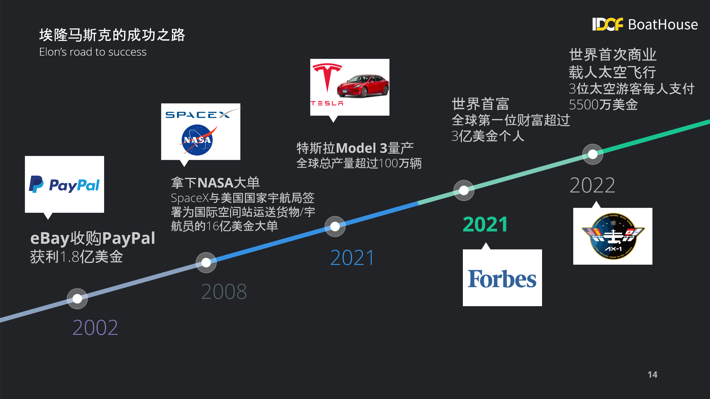
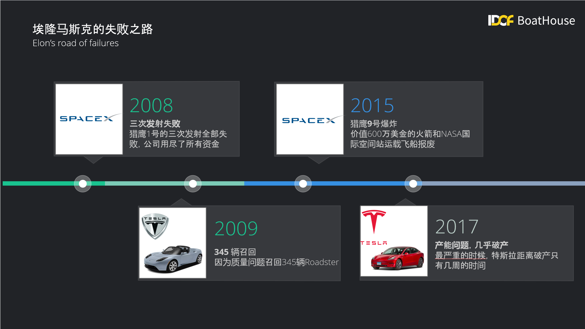
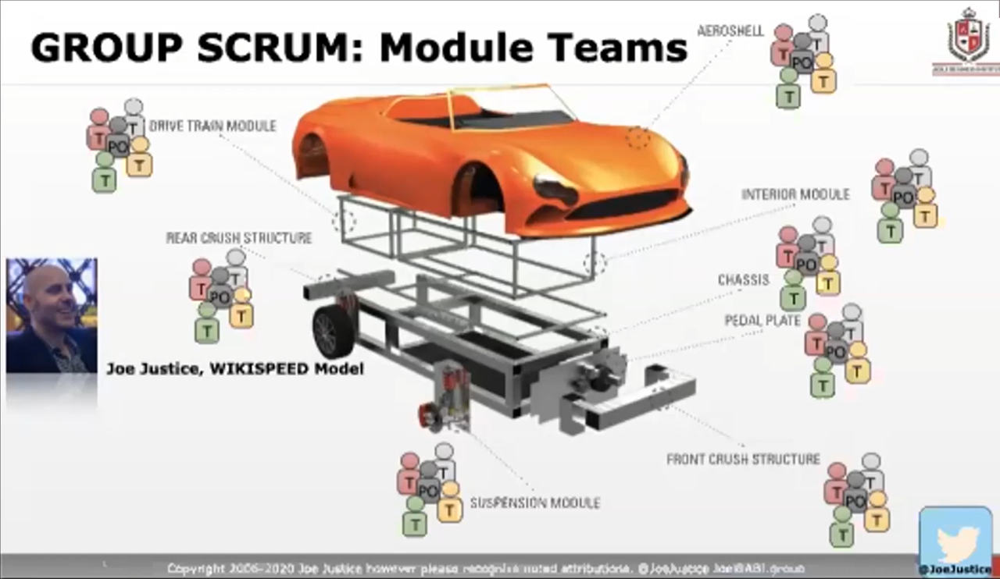
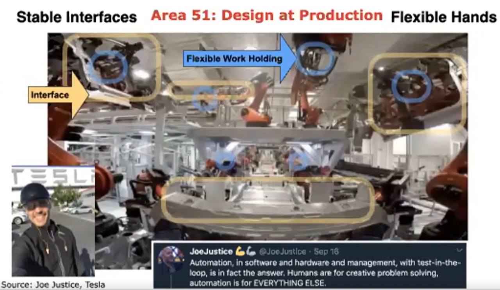
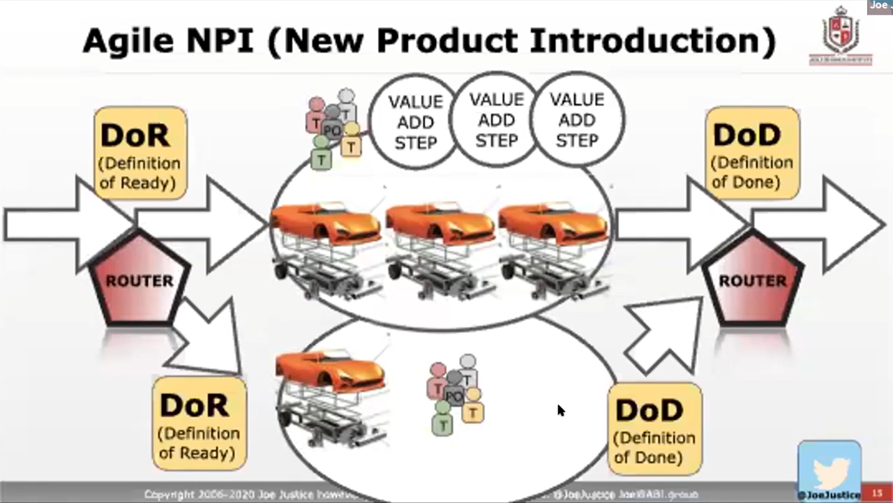
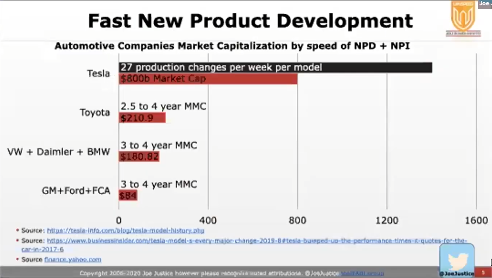
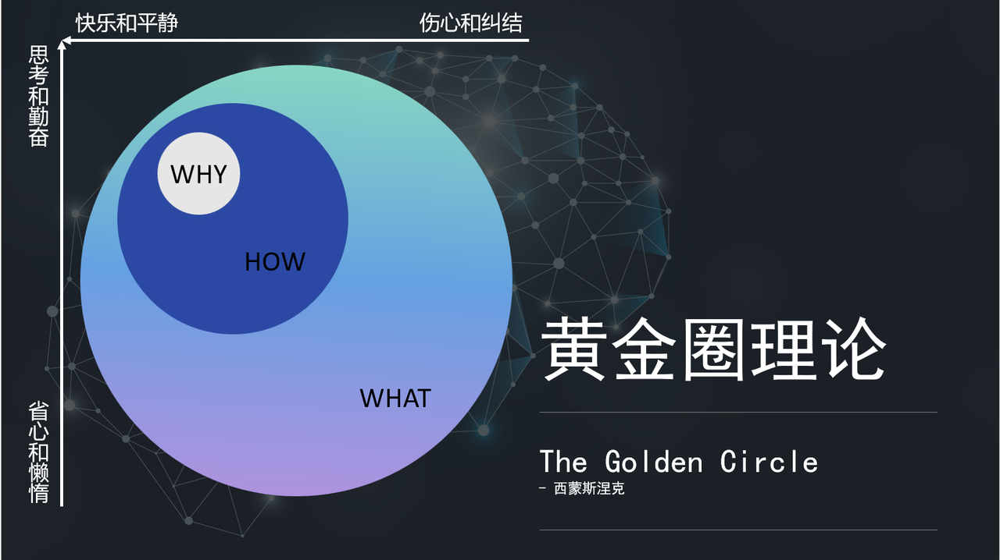

## 开挂20年

截至2022年7月，埃隆马斯克（Elon Musk）个人财富为 2214亿 美金，他同时还是多家公司的CEO和创始人，包括：特斯拉，SpaceX，SolarCity，The Boring Company, Neualink 以及 OpenAI。但是大家恐怕没有注意到在马斯克众多的CEO头衔的后面，他也是特斯拉和SpaceX两家公司的首席工程师（Chief Engineer）。作为全球首富，这个首席工程师的头衔恐怕是绝无仅有的。实际上，马斯克确实是一位非常专业以及敬业的工程师，而他自己也更愿意被称为一名工程师而不是CEO。

如果看一下马斯克过去的20年，那绝对是开挂一样。2002年将PayPal卖给了eBay公司，个人获利1.8亿美金，如果你纳闷为什么这个叫做PayPal的产品这么值钱，那么我只需要告诉你支付宝的原型是PayPal，淘宝的原型是eBay，你就可以理解1.8亿美金其实一点都不多。如果现在让马云把支付宝卖掉，那绝对不只是这个数字。马斯克将这1.8亿美金全部投入到三家公司中，分别是：SpaceX（1亿美金），特斯拉（7000万美金） ，SolarCity（1000万美金）。2008年，SpaceX拿下美国国家航天局（NASA）价值16亿美元的大单，负责为国际空间站（ISS）提供货运飞船服务以及后续的载人航天任务。2021年，特斯拉所生产的 Model 3 轿车成为人类历史上销量最好的全电动汽车，总销量超过100万辆；同年，根据福布斯杂志的数据，埃隆马斯克成为世界首富。2022年，SpaceX成功实现了人类历史上第一家实现载人航天任务的私人公司，并且将三位亿万富翁送上了国际空间站，每人的火箭票价为5500万美金。在SpaceX之前，只有三个国家有能力将人类送入太空，分别是：中国、美国和俄罗斯。

在同样的时间线上，我们还可以看到另外一个经历了无数失败的马斯克。在SpaceX获得NASA的16亿美金订单之前，SpaceX已经炸毁了3枚火箭，准确的说猎鹰1号的前三次发射全部失败，这三次失败的发射已经几乎烧光了马斯克投入到SpaceX的1亿美金。在这个时间点，没有人相信马斯克的SpaceX可以成功发射火箭，因为在他之前，发射火箭这件事情一直被认为是只有国家这样的实体才能完成的任务。庆幸的是，2008年，猎鹰1号的第四次发射任务终于成功，也因此才有了NASA的订单，SpaceX才活了下来。即便如此，后续的SpaceX发射任务也不顺利，猎鹰9号火箭的首级回收经历了多次失败，而且在2015年最大一次事故中，整个火箭空中爆炸，价值600万美金的火箭和飞船全部报废。这个过程中，特斯拉的发展也不顺利，2009年就因为质量问题召回了345辆已经售出的Roadster，后续又出现了多起特斯拉自动驾驶事故将这个公司推入风口浪尖。而最大的挑战莫过于2017年特斯拉宣布推出 Model 3 车型以后经历的 “量产地狱”。马斯克在这一年的大多数时间都一直睡在特斯拉工厂的沙发和地板上，每天和工人一起解决生产线上出现的各种问题。Model 3的生产其实几乎让特斯拉到达破产的边缘，最严重的时候特斯拉距离破产只有几周的时间。

> 马斯克的5步工作法也诞生于这段时期马斯克自己对于 “量产地狱” 的亲身体验和经验总结。

## 五步工作法

下面这段视频来自 *平民宇航员（everyday astronaut）* 于2021年8月4日发布在Youtube上的一段采访，在采访中 everyday astronaut 的主播和马斯克一起参观了星舰（starship - 马斯克用来建立火星基地的飞船）的制造和发射基地。在参观过程中，马斯克突然回忆起自己在构建 Model 3 生产系统过程中的种种惨痛经历，总结了五步工作法并明确表示他正在全公司强力推广。



五步工作法并不复杂

1. **验证你的需求：** 所有的需求都是假设，**既然是需求，就是仍未实现的事情，你如何证明一个还不存在事物的正确性？** 马斯克特别强调了，在收到需求的时候一定要质疑，特别是那些来自专家的需求，因为你会不假思索的被对方的专业性所麻痹。但是任何人的专业性都来自他已经完成的事情，这种专业性只能说明他过去是对的，无法保障对未知事物的准确预测。

2. **最少的流程：** 对于一个组织来说，**如果没有觉得流程不够用，就说明流程已经太多了。** 组织中存在流程是一件好事，但是如果所有的事情都有流程，那么组织中的个体就失去了创新和探索的能力，因此流程用于那些已经验证过的问题，无法应对未知的场景。当一个组织用既定的方式去应对不相匹配的全新问题的时候只有2种结果，1）流程会失效无法推进；2）按照既定流程做出错误的决策并造成不可预料的结果。无论哪种情况，最终受到伤害的都是组织本身。出现类似问题的时候，需要组织中个体站出来创造性的解决问题，只有这样组织才能充分适应未知的情况。当然这还必须依赖组织中鼓励创新的激励措施，有关于这一点马斯克也在很多场合提到过自己公司中是如何激励创新的。

3. **简化和优化：** 所有的管理理论都在提简化和优化，但是 **简化和优化的前提是目标的正确性（第一步）和鼓励创新的组织文化。** 否则要么方向错误，要么找不到简化和优化的余地。“这个事情没有办法，流程就是这样”，这样的说法大家一定都听到过，其实这就是组织缺少创新激励文化的体现。

4. **加速迭代：** 注意我们需要 **加速的是迭代，而不是速度。** 迭代是一个循环，通过这个循环我们可以不停的验证当前推进的方向，并且持续的进行改进和优化。因此，**五步工作法不是一个单向一次性的行为，而应该在最小可执行粒度上持续的循环推进。** 也意味着，你需要持续的质疑需求，持续的优化流程，持续的探索加速这个循环。这个过程的最终状态是组织进入一个自我推动，自我加速的状态，形成持续的创新和响应异常情况的能力，其实就是我们常说的敏捷性（agility）。

5. **自动化：** 自动化水平恐怕是很多行业展示自身能力的一个特别吸引眼球的地方，相信大家所看到的大多数介绍特斯拉工厂的视频中展示的也都是高度自动化流水线，机器人以及空无一人的厂房。实际上，按照马斯克自己说法，他一直都希望特斯拉工厂中能够有更多的工人而不是全部都由机器人来工作。**自动化的弊端有3个，分别是 1）高昂的成本；2）极高的出错几率；3）妨碍引入新特性。** 实际上，**特斯拉工厂中的工人数量大大多于其他汽车生产厂家，这其实也是马斯克有意为之。** 一来是因为特斯拉汽车几乎所有的零部件都是自己生产/非外包的，这让特斯拉的工厂承载了几乎普通汽车厂家的整个产业链上工人的数量。其次，机器人/流水线都只能在非常严苛的固定条件下才能顺利工作，一旦出现异常，整条流水线都必须停下来等待问题的解决。这让整个流水线变成一个严重前后依赖的单线程系统，而马斯克真正希望构建的是一个可以随时更换组件、流程、探索新特性的并行系统。

## 特斯拉如何像造软件一样造汽车

这里不得不说明一下特斯拉革命性的汽车生产流水线，和传统汽车厂的流水线相比较有非常大的不同。并不是说特斯拉的生产线使用了更多的自动化机器人，而是特斯拉的生产线可以随时引入新特性，新部件和新的生产工序；这个特性 **非常像在互联网软件开发中所使用的灰度发布方式。** 相对而言，传统车厂的流水线只能重复生产同样的型号汽车，不具备随时更换配件，工序以及引入新型号的能力。

为了做到这种高度灵活的生产流水线，特斯拉做到了3点传统车厂望尘莫及的事情：1）高度模块化的车辆设计；2）生产中测试的能力；3）灰度制造流水线。

### 1）高度模块化的车辆设计

首先，特斯拉的车辆设计是高度模块化的，每个模块之间用明确的接口定义（API）来进行对接，这种设计模式让特斯拉可以围绕车辆形成多个独立工作又可以相互协作的小型团队（Scrum团队）。

来源: Agile Hardware https://www.youtube.com/watch?v=_rySu6FZ18c (2021.3.30)

### 2）生产中测试的能力

其次，**生产中测试的能力（Test in Production）** 是特斯拉能够实现高度自动化流水线，同时允许引入新特性的重要前提。在以上模块的基础上，特斯拉开发了可以在生产线上执行并验证的大量自动化测试，这些测试不需要等到车辆下线以后再执行，而可以在车辆的装配过程中随时执行。这些大量的自动化测试所构建的Test in Production能力，让特斯拉可以放心的随意更换车辆组件，同时确保最终的产品质量。

有了模块化和自动化测试得保障，特斯拉可以放心大胆得实施自动化，并且可以随时引入新功能，新组件。

> " Humans are for creative problem solving, automation is for EVERYTHING ELSE." 

> " 人的作用是创造性的解决问题，剩下的所有重复性工作交给 **自动化**。

### 3）灰度制造流水线

有了以上模组化的架构和在生产中测试的能力，特斯拉可以实现以下的 **Agile NPI（新产品引入）** 能力。这整个的过程非常像互联网公司的软件灰度发布过程，比如你会看到APP中所显示的商品价格和其他人不同，或者你能够尝试一些新的功能而其他人还看不到。类似这样的产品发布方式称之为灰度发布。特斯拉在的汽车（硬件）生产线上实现了类似的能力，这个过程简单来说有这样几个步骤：

- 在某个生产工序之前和之后各安装一个路由器，注意这个路由器上运送的是组装中的汽车
- 当特斯拉的某个组件团队（Scrum团队）需要尝试安装新组件的时候，会通过以上路由器从主线上提取一辆汽车作为实验品（fork a car - 类似于软件开发中拉代码分支的过程）
- 这个组件团队在这辆实验品汽车上安装新的零件，同时确保这个新安装的组件可以通过和主线一样的质量验证步骤；这里涉及两个重要的措施，DoR(Definition of Ready 就绪标准) 和 DoD(Definition of Done 完成标准)。就绪标准和完成标准，一前一后，利用前面提到的生产中测试的能力，确保进入工序和离开工序的试验品车辆的质量。
- 通过了质量验证的实验品车辆合并回到主线，于其他车辆一同下线并直接发送到最终用户手中

具备了 Agile NPI 能力的特斯拉生产线，每一辆下线的汽车都可以是不一样的。特斯来对于已经发售汽车的跟踪方式也和传统车企不同，传统车企一般会用年度型号来标识汽车的类型，比如：2021款，2022款，每一个款型的配置是一样的；但是特斯拉的每辆汽车都是被独立跟踪的，因为每辆汽车的零部件和程序可能都是不同的。下图中可以看到，特斯拉可以 **每周推出多达27项** 产品改进，而传统车厂需要 **2.5-4年的时间才能推出一款新车**。

> 简单粗暴的计算一下，特斯拉的创新速度是传统车企的 27 * 52 * 2.5 = 3510倍。

这其实就是为什么传统车厂会处于绝对的劣势，因为特斯拉已经将敏捷能力根治于生产系统中，采用的是和造软件类似的方式，而传统车企还在使用100年前福特T型车的古老生产方式。当然，构建这样的生产系统是一件非常复杂而且困难的事情。

> 马斯克自己说过：构建特斯拉生产线的难度高于设计特斯拉汽车100倍。

2017年的多数时间，马斯克都住在特斯拉的加州工厂中和工人一起改进这个生产线。以下这段视频中马斯克讲述了这个过程中的一个优化点，你无法想象从生产环节中删除一个小小的玻璃纤维垫竟然可以节省超过200万美元的生产制造成本。



## 敏捷思维方法

以上出现了很多大家可能并不熟悉的词汇，比如：Scrum, DoR, DoD等等。其实这些概念都来自于敏捷思维方法。实际上马斯克的五步工作法就是典型的敏捷思维体现，其中前3个步骤解决的是 **做正确的事** 的问题，后3个步骤解决的是 **正确的做事** 的问题，中间的第三步是衔接前后的关键，也是 **形成组织敏捷性（agility）或者自驱力** 的关键。

> 如果用最浅显的语言来解释敏捷，那就是：一切都在变化，不变应万变的唯一方式就是响应变化。

虽然敏捷思维来自西方（敏捷的准确定义来自 [The Agile Mainfesto 敏捷宣言](https://agilemanifesto.org/) )，但其实中国文化中一直都存在类似的说法和思维模式，比如：天下武功唯快不破，这里的快指的的就是敏捷。当然，这里的快所指的并不是速度快，而是反应快。这一点我相信看过武侠小说的小伙伴都能理解。真正的高手从来不会拘泥于某种招式，兵器或者套路，而是见招拆招，手中无剑胜似有剑。这其中的境界其实就是可以应对世间万物风云变化，我自岿然不动的唯一方式：敏捷。

## 黄金圈理论

**黄金圈理论（The Golden Circle）** 是管理大师西蒙斯涅克2010年在一段TED演讲中提出的，其核心思想是希望大家在关注事物的时候多关注背后的 WHY 而不要只看到外部的 WHAT。实际上马斯克的五步工作法也可以用黄金圈来进行解释，其中第一步就是在回答 WHY 的问题，为什么我们要这么做，这个需求到底是为了解决什么问题？然后，我们再来回答如何满足这个需求的问题（HOW），用最少的流程和持续的改进以最快的速度找到当前的最优解。方向正确以后再提出明确的任务（WHAT）并以最快的速度完成这些任务。

马斯克用五步工作法构建了 **一种持续的WHY-HOW-WHAT的迭代循环**，推动企业内部形成一种高效的创新文化。这其实就是为什么马斯克所创办的企业能够在这么短的时间内创造出这么多令人惊叹的成果的原因。

马斯克曾经在自己的Twitter上写过这样一段话：

> "Pace of innovation is all that matters in the long run！"

我会把它翻译成

> “长跑冠军的秘诀从来都不是速度、而是配速！”。

相信热爱跑步的小伙伴一定知道我在说什么。

## 参考资料

- [Insights of Agile at Tesla with Joe Justice](https://www.linkedin.com/pulse/insights-agile-tesla-joe-justice-h%C3%A0o-l%C7%90/)
- [How Elon Musk plans to occupy Mars, the agile way](https://thelowdown.momentum.asia/how-elon-musk-plans-to-occupy-mars-the-agile-way/)
- [Joe Justice | The Secrets to Agility at Tesla | Elon's Master Plan to Infinity](https://www.youtube.com/watch?v=AKqKCn4fheY)
- [Model 3 production hell](https://markets.businessinsider.com/news/stocks/tesla-stock-price-tesla-is-in-its-third-stage-of-hell-with-model-3-2019-3-1028032448)
- [Evidence that Musk is the Chief Engineer of SpaceX](https://www.reddit.com/r/SpaceXLounge/comments/k1e0ta/evidence_that_musk_is_the_chief_engineer_of_spacex/)
- [Tesla Model 3 Has Passed 1 Million Sales](https://cleantechnica.com/2021/08/26/tesla-model-3-has-passed-1-million-sales/)
- [Model 3 Wikipedia Page](https://en.wikipedia.org/wiki/Tesla_Model_3)
- [The 5 Failures of Elon Musk and How He Overcame Them](https://press.farm/the-5-failures-of-elon-musk-and-how-he-overcame-them/)

