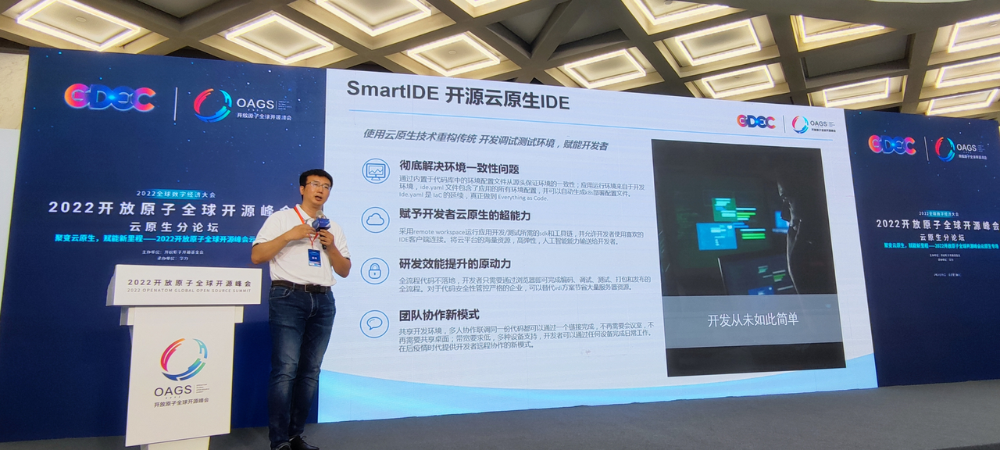
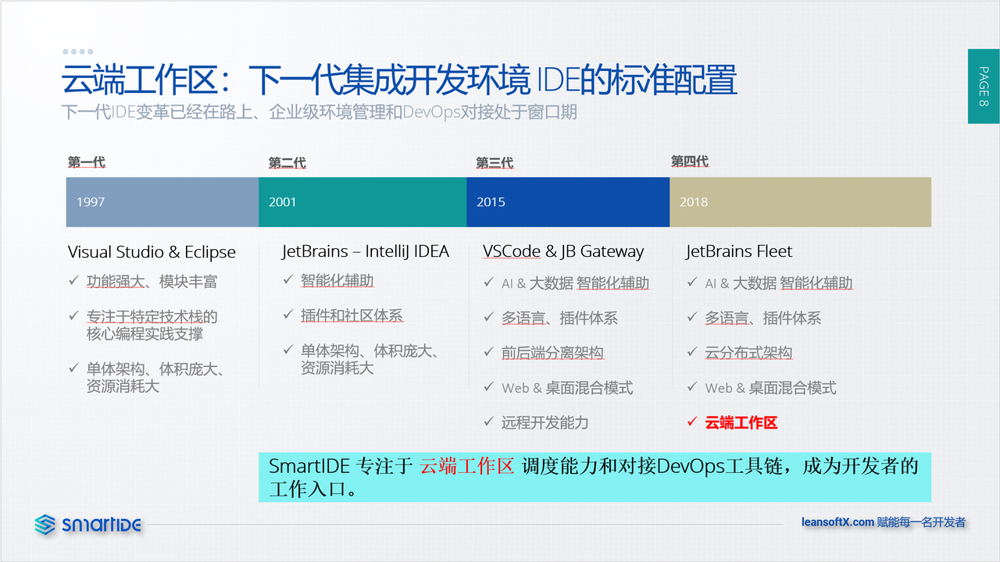
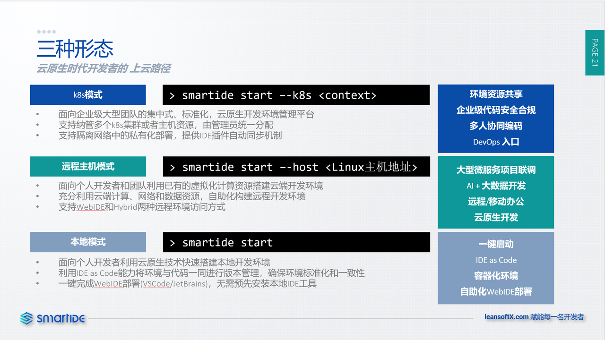
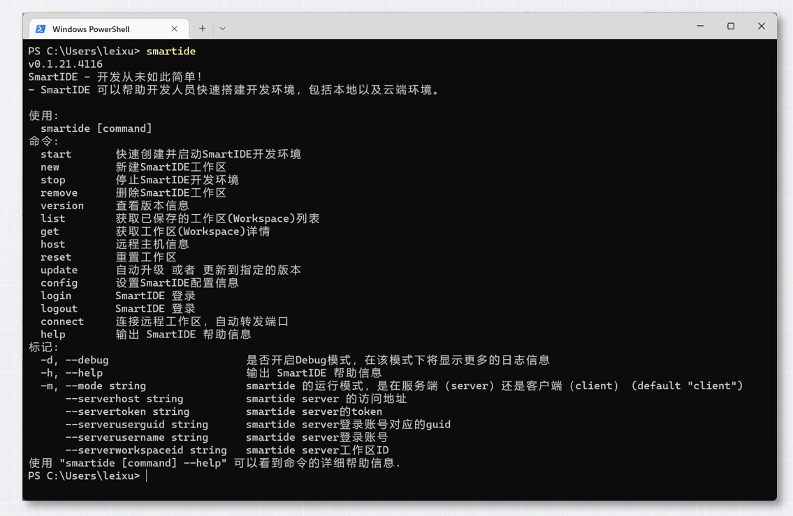
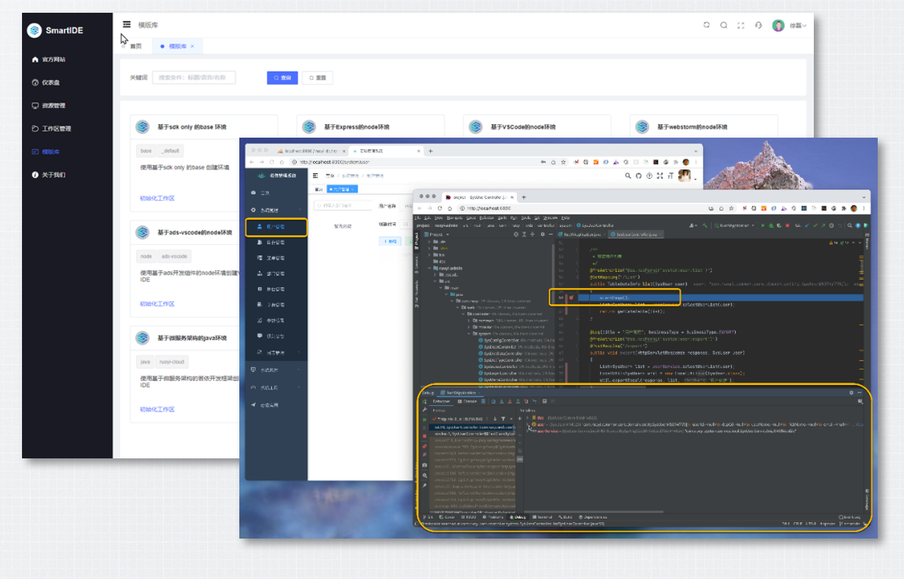
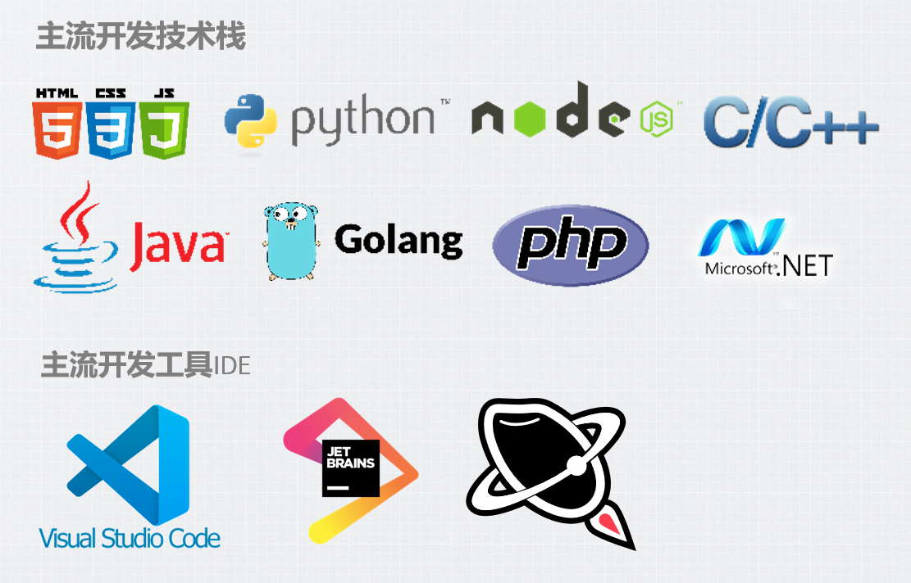
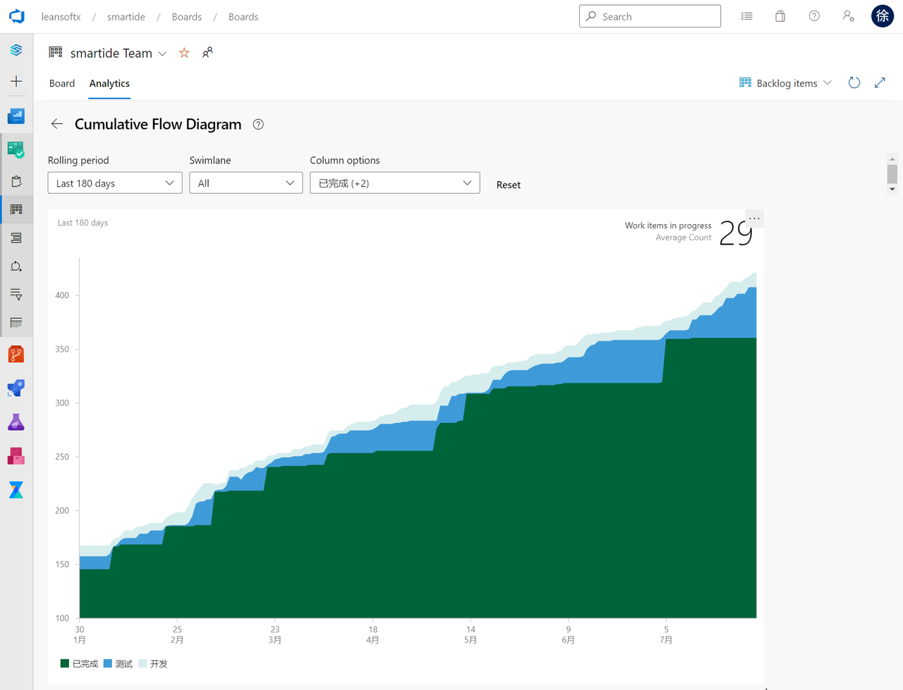
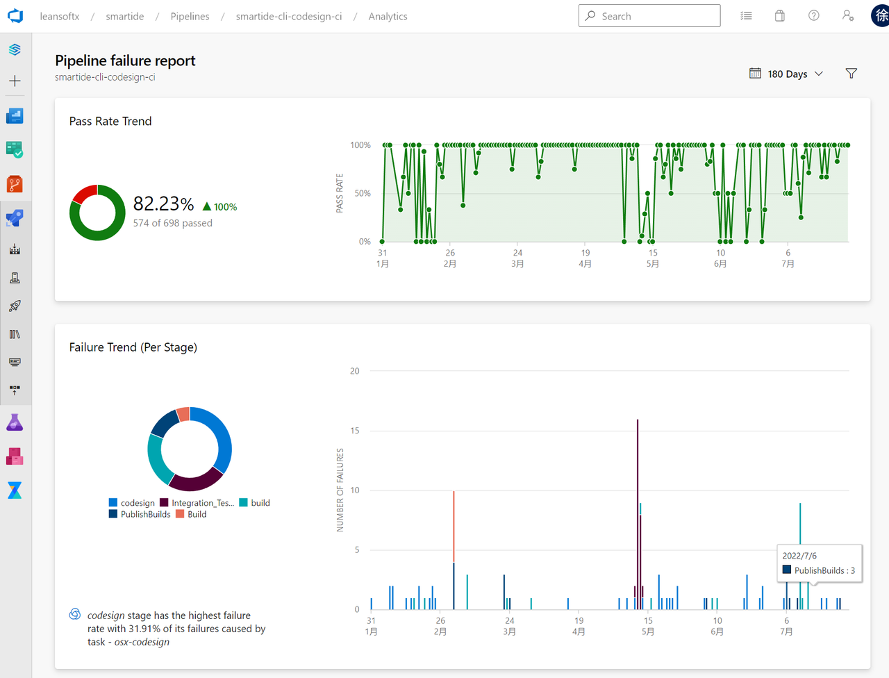
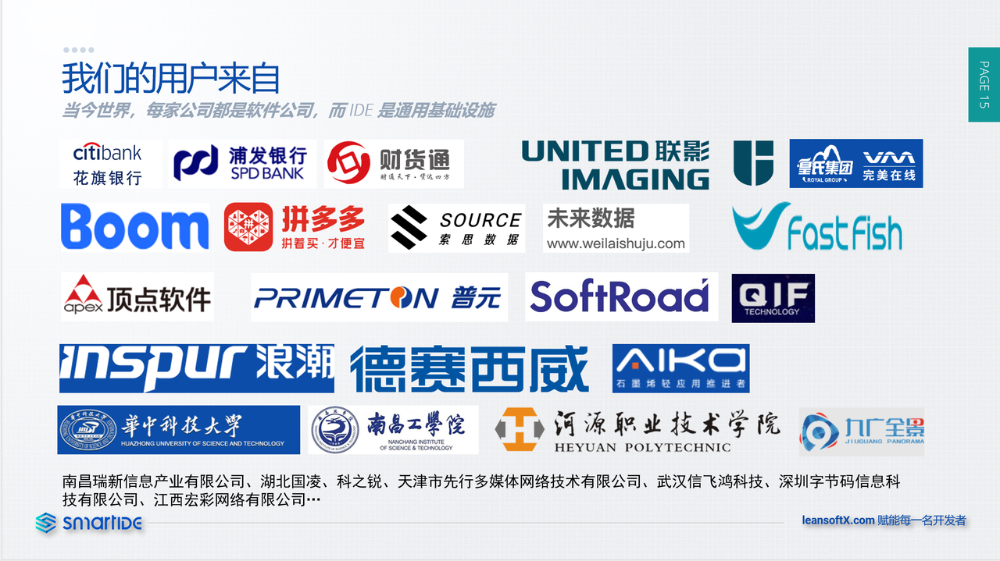

开放原子开源基金会是致力于推动全球开源事业发展的非营利机构，于 2020 年 6 月在北京成立，由 **阿里巴巴、百度、华为、浪潮、360、腾讯、招商银行** 等多家龙头科技企业联合发起。本次开源峰会是开放原子的年度品牌活动、全球开源领域的高端峰会。包括 **工信部副部长王江平、北京市副市长靳伟、中国科学院院士梅宏，Linux基金会执行董事Jim Zemlin，Eclipse基金会执行董事Mike Milinkovich** 以及来自阿里，腾讯，蚂蚁，华为，中软国际，英特尔等来自国内外的重磅嘉宾参与了本次会议。**SmartIDE在本次峰会的云原生论坛上展示了项目当前的进展以及下一代云原生CloudIDE的使用场景。**

## 我们为什么要做SmartIDE？

如今，软件确实已经深入我们生活的方方面面，没有软件你甚至无法点餐，无法购物，无法交水电费；我们生活的每一个环节都已经被软件包裹。在这些软件的背后是云计算，大数据和人工智能等等各种高新科技；这些现代IT基础设施在过去的5年左右获得了非常显著的发展，我们每个人都是这些高科技成果的受益者 … … 但是，为你提供这些高科技成果的 **开发者们自己所使用的软件（开发工具）却仍然像 “刀耕火种” 一般落后。**

你可能会觉得这是危言耸听，那么让我来举一个简单的例子：大家一定都通过微信给自己的朋友发送过图片，这个过程非常简单，拿出手机，拍照，打开微信点击发送图片，完成。收到图片的朋友直接打开就可以看到你拍摄的照片了。但是对于开发者来说，**如果要将一份代码发送给另外一位开发者，那么对方可能要用几个小时甚至几天的时间才能看到这份代码运行的样子。** 作为普通人，你无法理解这是为什么，如果你是一名开发者，你一定知道我在说什么！当然，我们也不指望普通人能够理解我们，对么？

上面漫画中的场景是不是很熟悉？开发环境的搭建对于开发者来说理所当然的是要占用大量时间和精力的，但是对于 “产品经理/领导/老板/老婆/老妈/朋友” 来说，开始写代码就应该像打开Word写个文档一样简单，只有开发者自己知道这其实很不简单。

解决以上问题的终极方案就是云端工作区，从IDE产品本身的发展历程来看，在经历了超过30年的三代产品的发展演进后，主流IDE厂商都在向着云端工作区的方向发展。SmartIDE就是在这个大背景下应运而生的下一代IDE云端工作区管理工具。

## SmartIDE能帮你做些什么？

SmartIDE可以帮助你完成开发环境的一键搭建，如果你熟悉命令行操作，那么么安装我们的cli，然后你只需要学会一个命令 `smartide start` 就可以在自己所需要的环境中，使用自己喜欢的开发工具进行编码和开发调试了，不再需要安装任何工具，SDK，调试器，编译器，环境变量等繁琐的操作。如果不喜欢命令行操作，也可以使用 SmartIDE Server 通过网页完成全部操作。

如果我们把Vscode和JetBrain这些IDE称为传统IDE的话，这些传统IDE最大的问题是：**他们虽然在 I (Integration) 和 D (Development) 上面都做的非常不错，但是都没有解决 E (Environment) 的问题。**

SmartIDE提供了三种运行形态，针对开发者面临的不同场景，为开发者提供了简单方便一站式的开发调试环境解决方案。

- **本地模式：** 面向个人开发者提供完整闭环的容器化开发调试环境调度，开发者可以在Windows/MacOS/Linux三种操作系统上使用 smartide start 指令一键启动任何开发语言的项目代码，直接进入调试状态，不必安装任何SDK以及开发工具。

- **远程主机模式：** 面向个人开发者和团队开发者的远程容器化工作区启动模式，开发者可以将任何linux主机转变为一台全功能的CloudIDE服务器，使用同样的 smartide start 指令就可以完成远程服务器的管理和维护。对于需要使用云端服务器的强大算力、高速网络以及超大规模存储的人工智能，大数据，微服务开发场景，可以极大简化开发者管理远程开发环境的复杂度。

- **k8s模式：** 对于企业团队开发场景而言，能够将开发环境集中管理并标准化可以大幅降低开发团队花费在环境管理上的浪费，同时提升开发环境的安全性，稳定性以及开发效率。大型企业中使用标准化开发框架是普遍的实践，但是如何简单高效的推广这些开发框架是是一件非常困难的的事情，使用SmartIDE的k8s模式可以很好的解决这些问题。当前企业中已经有大量的k8s集群在使用，但绝大多数仅被用于测试和生产环境的管理，开发调测的环境在很多企业都处于无管理或者疏于管理的状态，这为企业级研发来了大量的安全和稳定性隐患。SmartIDE k8s模式就是针对企业级开发调测环境管理而设计的完整解决方案。

## SmartIDE v1.0 特性说明

**SmartIDE v1.0版本（CLI Build v1.0.23.4650，Server Build v1.0.23.4646）已经发布**，在发布了超过4000 Builds 之后，我们终于发布了v1.0版本。当前的版本已经完成了 **企业级云原生CloudIDE的特性闭环**，允许个人/团队/企业用户在Windows/Mac/Linux上使用VSCode/JetBrains全家桶/OpenSumi三种IDE开发7种技术栈下的任何项目，并且支持WebIDE和Hybrid混合模式以及WebTerminal的三种工作区访问方式。

SmartIDE产品体系包含 **CLI，Server，开发者容器与模版以及插件市场四大组件**，构成了企业级CloudIDE的完整生态环境。四大组件全部开源，为企业构建自主可控的私有化CloudIDE提供了一站式的解决方案。

- **CLI：** 是一个使用go语言开发的简单易用的命令行工具，可以在Windows/MacOS/Linux三种操作系统上运行，同时支持x86和arm两种cpu架构。覆盖了当前几乎所有主流的桌面，笔记本，服务器，边缘服务，IoT设备和移动操作系统环境。为SmartIDE提供了在任何平台上进行CloudIDE管理和调度的能力。其关键特性包括：

  - 一键创建容器化工作区
  - 本地、远程主机、k8s三种模式支持
  - 自动创建SSH安全隧道，避免开放远程主机端口
  - 使用环境模版一键创建预制的环境和代码框架
  - 工作区状态管理登录SmartIDE Server实现远程端口监听
  - Headless运行模式，支持流水线集成（当前已经提供了 GitLab CI 的集成）

- **Server：**  采用vue.js + go语言开发的开源企业级CloudIDE管理平台，支持单机和高可用两种部署模式，支持在隔离的企业环境内部署，支持多集群管理。主要特性包括：
  - 资源集中管控，支持纳管多台Linux主机或者k8s集群
  - 端到端的代码安全，实现研发过程全程代码不落地
  - 工作区入口，聚合所有研发资源
  - 环境模版，一键创建标准化开发环境
  - 团队管理，自由组合开发人员，按团队分配资源
  - 工作区策略、统一管理开发人员“本地”环境配置
  - 环境共享和协同开发

- **开发者镜像&模板：** 一整套完整的容器化环境镜像和可扩展的模板系统，支持7类主流开发语言并可以扩展到任何开发语言和框架的支持。主要特性包括：
  - 利用容器分层技术加速工作区加载
  - 三种主流IDE支持，VSCode, JetBrains全家桶和阿里OpenSumi
  - 多种工作区接入方式：包括WebIDE、Hybrid混动、WebTerminal和Web文件环境以及SSH直连
  - Hybrid混动模式同时支持 VSCode Remote和 JetBrains Gateway 两种接入模式
  - Rootless安全保障，使用非root用户运行容器内进程，避免容器越权
  - 支持在容器内运行完整Docker和Kubernetes集群（VMLC模式），完美支持云原生开发场景

- **IDE插件市场：** 现代IDE需要使用大量插件扩展自身能力，在企业内部提供统一受控的插件市场有助于企业对开发调测环境、代码安全以及应用架构进行有效管控。我们基于Eclipse OpenVSX扩展开发了SmartIDE Marketplace，支持在隔离私有网络进行本地化部署并提供插件同步机制。主要特性包括：
  - 插件自动同步，使用预制脚本自动同步插件（包括历史版本）
  - 支持多种类VSCode IDE，比如：VSCodium, Code-Server, OpenVSCode Server，Eclipse Theia，OpenSumi

## 产品进展

SmartIDE的开发工作采用敏捷（Scrum&Kanban）方式进行，2周一个Sprint并且采用了高度自动化的流水线完成代码的构建，自动化测试和发布工作。到今天为止，我们已经完成了 **超过4000个版本的发布，CLI每周下载量超过1000次。**

过去的6个月中，我们完成了超过 **400个特性的开发和交付，CLI完成了698次构建，Server完成了701次构建。**

当前我们已经有来自几十家企业的超过200名早期使用者

## 开源进展

SmartIDE采用GitHub和Gitee双地址开源方式，并且支持社区开发者使用任何一个开源平台与我们的产品团队进行协作。为了满足开源社区协作和产品商业化开发同步推进的诉求，我们设计了【SmartIDE开源工作体系】，帮助产品团队和社区开发者统一认知，高效协作。

具体可以参考：[开源工作体系](/zh/docs/opensource/)

在GitHub和Gitee有非常多的小伙伴与我们互动，一共提交了723个commit，获得了超过500个star，80个Fork。

当前SmartIDE已经进入开放原子基金会项目捐赠的TOC审核阶段，我们相信“软件定义世界，开源共筑未来”的理念，通过开放原子基金会的运作，SmartIDE将会继续扩大我们的社区影响力，吸引更多的共建单位一起构建开发者生态。以IDE这一软件开发基础软件为切入点，为更多的开发者和企业赋能，在开源开发者工作模式、企业级研发效能和信创领域打造世界级的下一代IDE工具平台。

> 欢迎更多的开发者和企业加入SmartIDE的开发协作，让我们一起做一个自己喜欢的工具。

徐磊 
2022.7.29日于北京
