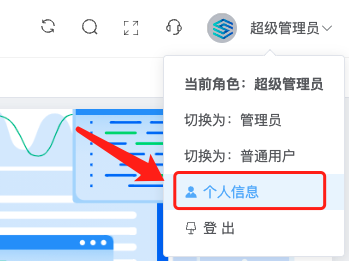

SmartIDE Server 是面向团队和企业的云原生容器化远程工作区管理平台，可以为开发团队提供统一的开发测试资源管理，基于浏览器的开发环境访问以及团队协作能力。SmartIDE Server 的 团队基础版 功能是开源而且免费的，任何人都可以按照本手册所提供的方式完成部署并免费使用，没有使用期限限制，没有用户数限制，也没有资源数量限制。

如果您所使用的服务器环境可以连接互联网，可以使用我们以下提供的全自动一键安装方式完成安装部署；如果你处于隔离网络（无法访问互联网），我们也提供可供下载导入到隔离网络中的离线安装方式，可以通过 <a href="https://leansoftx.feishu.cn/share/base/shrcntjR3kpuAZprfUTSWXar1pK" target="_blank">提交技术支持申请</a> 的方式获取这些资源。

## 架构图和组件说明

下图展示了SmartIDE Server环境的架构；总体来说，SmartIDE Server 采用了非常灵活并且可扩展的分布式架构，每个服务组件都可以进行独立的横向扩展以便确保可以应对不同规模的部署模式需求。




下面对上图中各个组件进行说明，以便对本手册中所涉及的内容进行准确理解：
- 核心服务：包括Server所提供的Web界面，API服务，后台的数据持久化（Redis & MySQL），以及提供对外访问的反向代理服务（nginx）。对Server的所有访问均通过反向代理服务进行统一控制，方便企业用户在部署时与现有网络架构进行整合。
  - 容器化部署：核心服务中的所有组件全部采用容器化部署方式，对于小型团队部署环境，我们提供docker-compose文件将所有服务部署在一台linux主机上，对于中大型团队中的部署模式，提供对应的k8s manifest文件以便部署在k8s集群中。
  - 辅助管理工具：phpMyAdmin提供MySQL数据的管理界面，Portainer提供docker容器环境的管理，可以用于服务节点的问题定位，日志查看和重启等操作。单机版部署模式下默认在docker-compose中包含这两个工具。
- 核心K8S服务：采用基于tekton流水线引擎提供的SmartIDE工作区弹性调度组件。远程工作区是SmartIDE中最重要的管理对象，对于远程工作区的所有调度任务均通过tekton流水线任务完成。在这些调度任务中，实际执行的就是 SmartIDE CLI。CLI中内置的 mode=server 模式就是为了在这个场景中使用而设计的，mode=server 模式最大化重用了 CLI 本身的能力，同时针对流水线调度环境进行了少量适配。采用这种架构，SmartIDE 可以简化调度动作的开发调试复杂度，同时将Server核心组件与工作区资源进行解耦，也就是说SmartIDE Server的核心服务不会直接连接工作区资源，这样就让核心服务可以专注于企业业务场景，而将远程工作区调度的工作职责全部交给CLI来完成。
  - 高可用性：tekton流水线引擎本身是一个 k8s CRD 实现，其可用性来自于k8s本身的高可用性。这样的设计可以确保 SmartIDE的核心能力直接集成企业云原生架构的可用性。
  - 弹性和扩展性：SmartIDE具体的调度工作全部都通过核心k8s服务集群完成，完全不依赖server核心服务的算力和资源，这样也确保了在大规模团队使用场景下的弹性扩展。
- 工作区资源：SmartIDE支持主机和k8s两类资源，管理员可以自行将资源注册到 SmartIDE Server 即可允许用户使用这些资源来运行远程工作区环境。SmartIDE实际的工作负载其实全部运行在这些工作区资源上，无论是 WebIDE，代码编译，测试以及工作所需要的中间件环境都完全不依赖server核心服务以及核心k8s集群的资源。企业管理员可以根据需要随时增加或者减少注册给SmartIDE的工作区资源以便确保企业内部资源的合理利用。
  - 主机类资源：和SmartIDE CLI一样，开发者只需要一台可以运行Docker的Linux主机即可将SmartIDE远程工作区部署在上面使用。对于还没有使用k8s的企业来说，可以将闲置的物理机，虚拟机注册在SmartIDE Server上统一管理并分配给开发者使用。这些主机也无需特别的网络配置，只需要开通SSH服务即可。
  - K8S类资源：管理员可以将一个或者多个k8s集群注册到Server，并分配给开发者使用。SmartIDE Server会自动完成对k8s集群的必要初始化操作，并利用命名空间（Namespace）隔离不同开发者的远程工作区环境，包括资源用量限制。

## 部署模式
SmartIDE Server 提供三种不同的部署架构以便适应不同规模的团队使用
- 单机版安装：只需要一台linux服务器就可以完成整个Server环境的安装和部署，包括核心服务和核心K8S集群均可以在一台主机上完成部署。在这个部署模式下，核心k8s集群会使用一个单节点的minikube来提供k8s的调度能力。对于小型团队来说，这种部署模式非常简单而且资源消耗很低。
- 多机版安装：可以将核心服务和k8s服务分别部署在2台或者多台主机中，这种部署模式适合中等规模的团队，或者没有k8s基础环境的企业。搭配主机类工作区资源，可以在完全没有k8s环境下使用SmartIDE Server。
- 集群安装：如果企业已经具备了现有的k8s环境，那么可以将SmartIDE Server的全部组件都部署到k8s集群中以提供高可用，弹性和可扩展性，满足中到大型团队的日常使用；同时在需要扩展用量的时候临时接入主机或者K8S集群来满足需求。

## 单机版安装操作
以下操作过程针对单机版环境安装进行描述，如果需要进行多机或者集群安装部署，请 <a href="https://leansoftx.feishu.cn/share/base/shrcntjR3kpuAZprfUTSWXar1pK" target="_blank">提交技术支持申请</a> 。

### 环境要求
单机版环境可以满足10-50人团队日常使用需求，根据团队规模情况，请选择以下环境最小化或者建议配置。

| 级别     | 最大人数 | Linux发行版      | 配置                      |
| -------- | -------- | ---------------- | ------------------------- |
| 最小配置 | 10       | Ubuntu 20.04 LTS | 4核CPU，8G内存，100G硬盘  |
| 建议配置 | 50       | Ubuntu 20.04 LTS | 8核CPU，64G内存，500G硬盘 |

*备注：*

- *以上人数限制仅代表一个估计值，根据实际使用场景可能会有所不同；*
- *以上环境仅代表核心服务和核心K8S（采用minikube单节点模式）的服务器节点需求，工作区资源（主机或者K8S）需要另外准备；*
- *虽然可以将这个服务器也注册到Server的工作区资源列表中使用，但是非常不建议这样做，因为工作区调度任务会对节点进行文件操作和各种复杂控制，这个过程中很可能影响核心服务的运行；*
- *请确保使用干净的操作提供环境，如果主机上已经安装或者运行其他应用可能会在本手册操作过程中被损坏或者影响本手册的操作结果。*
- *当前只提供Ubuntu系统的一键安装脚本，其他发行版的脚本会陆续提供。*

### 账号和权限要求
不支持使用root账号进行操作，请按照以下方式创建非root+免密码sudo账号进行操作。如果当前只有root账号，请使用root账号SSH登录到服务器以后执行以下操作。
```
## 新增用户smartide,并设置sudo权限
sudo useradd smartide
sudo passwd smartide

## 编辑 sudoers 文件配置免密码sudo操作
sudo vim /etc/sudoers
## 在 Allow root to run any commands anywhere 的root下方设置sudo免密权限
smartide   ALL=(ALL) NOPASSWD: ALL
```
完成以上操作后用所创建的账号重新SSH登录系统，比如以上使用的是 smartide 账号，那么你的登录指令是：
```
ssh smartide@<server ip address> -p <server SSH port>
```
### 网络和防火墙要求
为了确保可以正常访问SmartIDE Sever的相关服务，请确保以下端口已经在网络防火墙或者网络策略中打通。

| 端口         | 服务           | 说明                                                         |
| ------------ | -------------- | ------------------------------------------------------------ |
| 8080         | WEB界面        | Server的主服务端口，用户通过这个端口访问SmartIDE Sever的Web界面 |
| 8090（可选） | phpMyAdmin界面 | MySQL数据库的Web管理界面，可以根据需要开放                   |
| 9000（可选） | Portainer 界面 | Docker环境的Web管理界面，可以根据需要开放                    |
| 9097（可选） | Tekton仪表盘   | Tekton流水线引擎的仪表盘Web界面，可以根据需要开放<br>备注：此无服务无身份验证，请谨慎开放此端口 |

### 一键安装部署脚本
请确保执行以下脚本之前已经完成了环境要求、账号要求、网络要求的检查；并且，请确保执行脚本的主机环境与互联网保持畅通。

在以下脚本执行过程中，会频繁的通过网络下载文件或者拉取容器镜像，如果因为网络问题造成安装终端，请从新执行脚本。
为了适应国内/国际网络的不同特性，我们提供了2个不同的脚本分别使用国内/国外的文件和镜像源获取安装介质，请根据你的服务器所处的网络环境自行决定使用哪个脚本完成安装。
国内网络一键安装

```bash
curl -LO https://gitee.com/smartide/SmartIDE/raw/main/deployment/deployment_cn.sh -o deployment_cn.sh&& bash deployment_cn.sh
```
国际网络一键安装
```bash
curl -s https://gitee.com/smartide/SmartIDE/raw/main/deployment/deployment.sh -o deployment.sh&& bash deployment.sh
```
安装步骤中，需要输入SmartIDE Server对外服务的IP地址，在这里输入本地对外服务的IP：

```
请输入本机对外服务的IP地址：XX.XX.XX.XX
```

安装过程一般需要持续10分钟左右，以下是安装的完整日志

```bash
localadmin@Private-Online-Deploy:~$ curl -LO https://gitee.com/smartide/SmartIDE/raw/main/deployment/deployment_cn.sh -o deployment_cn.sh&& bash deployment_cn.sh
SmartIDE Server Deployment Start...
请输入本机对外服务的IP地址：20.2.72.212
SmartIDE Server Deployment : 1.Basic Component
SmartIDE Server Deployment : 1.1 docker and docker-compose
...
SmartIDE Server Deployment : 1.2 Git
SmartIDE Server Deployment : 1.3 Kubectl
SmartIDE Server Deployment : 1.Basic Component Installed Successfully.
SmartIDE Server Deployment : 2.MiniKube
SmartIDE Server Deployment : 2.1 Minikube Install
SmartIDE Server Deployment : 2.2 Build Minikube Env
🔥  Deleting "minikube" in docker ...
🔥  Deleting container "minikube" ...
🔥  Removing /home/localadmin/.minikube/machines/minikube ...
💀  Removed all traces of the "minikube" cluster.
😄  minikube v1.24.0 on Ubuntu 20.04
✨  Using the docker driver based on user configuration
❗  Your cgroup does not allow setting memory.
    ▪ More information: https://docs.docker.com/engine/install/linux-postinstall/#your-kernel-does-not-support-cgroup-swap-limit-capabilities
✅  Using image repository registry.cn-hangzhou.aliyuncs.com/google_containers
👍  Starting control plane node minikube in cluster minikube
🚜  Pulling base image ...
🔥  Creating docker container (CPUs=2, Memory=4096MB) ...
🐳  Preparing Kubernetes v1.22.3 on Docker 20.10.8 ...
    ▪ Generating certificates and keys ...
    ▪ Booting up control plane ...
    ▪ Configuring RBAC rules ...
🔎  Verifying Kubernetes components...
    ▪ Using image registry.cn-hangzhou.aliyuncs.com/google_containers/storage-provisioner:v5
🌟  Enabled addons: storage-provisioner, default-storageclass
🏄  Done! kubectl is now configured to use "minikube" cluster and "default" namespace by default
    ▪ Using image registry.cn-hangzhou.aliyuncs.com/google_containers/nginx-ingress-controller:v1.0.4
    ▪ Using image registry.cn-hangzhou.aliyuncs.com/google_containers/kube-webhook-certgen:v1.1.1
    ▪ Using image registry.cn-hangzhou.aliyuncs.com/google_containers/kube-webhook-certgen:v1.1.1
🔎  Verifying ingress addon...
🌟  The 'ingress' addon is enabled
SmartIDE Server Deployment : 3.Tekton Pipeline
SmartIDE Server Deployment : 3.1 Kubectl Apply Tekton Pipeline And DashBoard
...
SmartIDE Server Deployment : 3.2 Kubectl Apply Tekton Trigger
...
SmartIDE Server Deployment : 3.3 Kubectl Apply Tekton SmartIDE Pipeline Configrate
...
SmartIDE Server Deployment : 3.Tekton Pipeline Installed Successfully.
SmartIDE Server Deployment : 4.SmartIDE Server
...
Network smartide-server-network is external, skipping
Creating gva-portainer ... done
Creating gva-mysql     ... done
Creating gva-myadmin   ... done
Creating gva-redis     ... done
Creating gva-server    ... done
Creating gva-web       ... done
SmartIDE Server Deployment : 4.SmartIDE Server Installed Successfully.
SmartIDE Server Deployment : 5.Build SmartIDE Server Network Connection With Minikube.
SmartIDE Server Deployment : 5.Build SmartIDE Server Network Connection With Minikube Successfully.
SmartIDE Server 服务地址：http://20.2.72.212:8080
SmartIDE Server Deployment Successfully！
```
请确保你的日志末尾出现  SmartIDE Server Deployment Successfully！的字样即表示安装已经顺利完成。

如果中途出现报错的情况，可以提交 Issue 与我们联系。
### 数据持久化与备份恢复
SmartIDE Server的数据均保存在MySQL数据库中。

- 备份：单机版部署中，MySQL数据已将久化到$HOME/smartide/mysql文件夹中，其中gva文件夹即为SmartIDE Server数据库。此时，只需在安装时的目录中，执行如下脚本停止Server服务后，拷贝gva文件夹即可完成备份，完成后重新启动服务。
```
# 停止SmartIDE Server服务
docker-compose -f docker-compose.yaml --env-file docker-compose_cn.env down
# 执行备份
cp -r $HOME/smartide/mysql/gva $HOME/smartide/gva-backup
# 重新SmartIDE Server服务
docker-compose -f docker-compose.yaml --env-file docker-compose_cn.env up -d
```

- 恢复：若在原主机中进行还原恢复，那么只需要将备份的gva文件夹，替换到$HOME/smartide/mysql/gva即可。若在其他机器中恢复，那么停止Server服务后，替换到$HOME/smartide/mysql/gva即可，完成后重新启动服务。
```
# 停止SmartIDE Server服务
docker-compose -f docker-compose.yaml --env-file docker-compose_cn.env down
# 执行备份
cp -r $HOME/smartide/gva-backup $HOME/smartide/mysql/gva
# 重新SmartIDE Server服务
docker-compose -f docker-compose.yaml --env-file docker-compose_cn.env up -d
```

### 访问环境
完成以上安装步骤后，就可以通过以下访问地址，访问部署好的Server了：
- 主服务 http://{deploment host ip}:8080
- MySQL管理界面（可选）http://{deploment host ip}:8090
- Docker环境管理界面（可选） http://{deploment host ip}:9000
- Tekton仪表盘（可选） http://{deploment host ip}:9097
注：若需使用Tekton仪表盘（可选）查看流水线执行情况，需在主机执行以下命令，后访问Tekton仪表盘，这个脚本会启用9097端口，请同时确保9097端口已经在网络中打通。
```bash
kubectl --namespace tekton-pipelines port-forward svc/tekton-dashboard 9097:9097 --address 0.0.0.0 &
```
### 初始账号和密码修改
初始超级管理员用户名密码
- 用户名：superadmin 
- 默认密码：SmartIDE@123

强烈建议立即修改以上账号的密码，此账号（superadmin）为系统超级管理员账号，可以在系统中进行任何操作（包括一些可能损坏SmartIDE现有功能的操作）。因此建议安装完成后立即修改此账号的密码。

修改密码操作：点击Server版右上角【个人信息】，并且点击【修改密码】操作即可。




请注意，superadmin账号还用于tekton流水线的调度，因此在修改密码后还需要更新 server配置文件中的 token 信息。你可以通过 SmartIDE CLI 执行 se login 指令并连接到当前 server 的主服务地址上并使用superadmin账号登录，此时打开 .ide/.ide.config 文件可以获取新token信息。


将此token中内容更新到 server-server 容器中的配置文件里面：

- 进入到安装目录的smartide-install目录，```vi config.docker.yaml```


- 修改完毕后，执行以下命令，重启启动gva-server容器即可。

```bash
docker restart gva-server
```

### 验证Server工作情况
可以参考 [Server快速开始](/zh/docs/quickstart/server) 文档完成主机资源注册和工作区创建操作，即可验证当前SmartIDE Server的功能工作正常。

## 技术支持
如果您在以上安装过程或者日常使用过程中遇到问题，请通过提交 Issue 的方式与我们取得联系。

也可以加入我们的 SmartIDE 早鸟群获取第一手的产品资料和技术支持。
对于隔离网络或者中大型部署模式的技术支持，请 <a href="https://leansoftx.feishu.cn/share/base/shrcntjR3kpuAZprfUTSWXar1pK" target="_blank">提交技术支持申请</a> ，我们会尽快与您取得联系。


## 参考资料
- <a href="https://docs.docker.com/get-docker/" target="_blank">Docker & Docker-Compose 官方安装手册</a>
- [CLI 安装说明](/zh/docs/install/cli/) 
- [Docker & Docker-Compose 安装手册 (Linux服务器)](/zh/docs/install/docker/linux/)
- <a href="https://tekton.dev/" target="_blank">Tekton 流水线引擎官网</a>
- <a href="https://minikube.sigs.k8s.io/docs/" target="_blank">` Minikube 官网 `</a>
