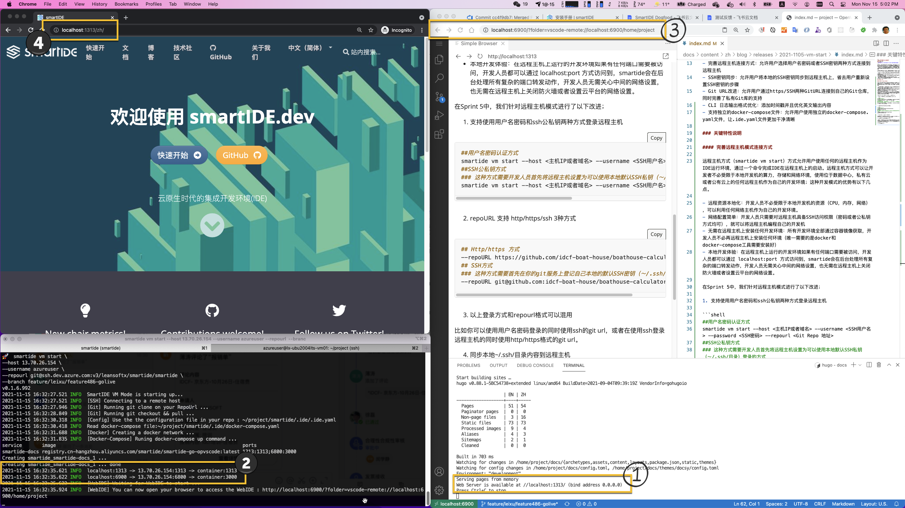
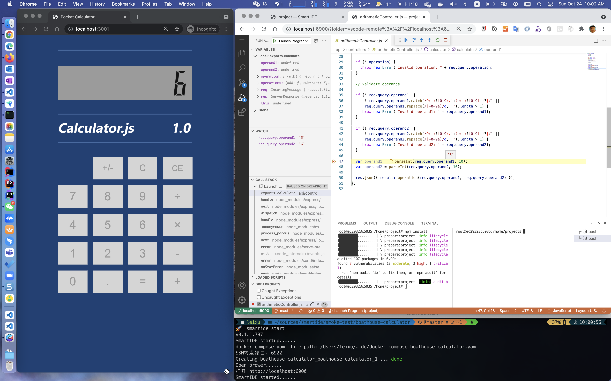

## 我们为什么要开发SmartIDE？

> 在当今这个软件吞噬世界的时代，每一家公司都是一家软件公司 ... ...

如今，软件确实已经深入我们生活的方方面面，没有软件你甚至无法点餐，无法购物，无法交水电费；我们生活的每一个环节都已经被软件包裹。在这些软件的背后是云计算，大数据和人工智能等等各种高新科技；这些现代IT基础设施在过去的5年左右获得了非常显著的发展，我们每个人都是这些高科技成果的受益者 ... ... 但是，为你提供这些高科技成果的开发者们自己所使用的软件（开发工具）却仍然像 “刀耕火种” 一般落后。

你可能会觉得这是危言耸听，那么让我来举一个简单的例子：大家一定都通过微信给自己的朋友发送过图片，这个过程非常简单，拿出手机，拍照，打开微信点击发送图片，完成。收到图片的朋友直接打开就可以看到你拍摄的照片了。但是对于开发者来说，如果要将一份代码快照发送给另外一位开发者，那么对方可能要用上几天的时间才能看到这份代码运行的样子。作为普通人，你恐怕无法理解这是为什么，如果你是一名开发者，你一定知道我在说什么！当然，我们也不指望普通人能够理解我们，对么？


这样的场景是不是很熟悉？开发环境的搭建对于开发者来说理所当然的是要占用大量时间和精力的，但是对于 “产品经理/领导/老板/老婆/老妈/朋友” 来说，开始写代码就应该像打开Word写个文档一样简单，只有开发者自己知道这其实很不简单。

但是开发者已经有了非常好用的IDE了，Visual Studio Code, JetBrain 全家桶都已经非常成熟，并不需要另外一个IDE了。确实，SmartIDE也并不是另外一个IDE，我们不会重新造轮子，我们只是希望你的轮子可以转的更快、更高效、更简单。

## SmartIDE和其他的同类产品有什么区别？

### 自助化自动化的WebIDE搭建

作为开发者，我希望一个人可以做到所有的事情，因此SmartIDE的设计就是要让开发者一个人就可以完成WebIDE的部署和日常使用，不依赖于任何角色，这也是为什么当前SmartIDE的应用形态是一个命令行工具。

使用SmartIDE你完全可以在自己的开发机上运行一个命令（smartide start），就可以创建出一个属于你自己的IDE环境。当然，如果你手头有其他的主机环境，那么只要你可以通过SSH登录到这台主机，你就可以将这台主机作为你的IDE环境使用，你所需要的及时一个命令（smartide start --host）而已。

### 远程开发、本地体验、上云很简单

WebIDE最大的好处就是可以通过云无限扩展开发者所需要的环境资源，比如：计算、存储、网络等。因此市场上所有其他的WebIDE产品均要求开发者登录到一个预先部署好的环境上使用。使用SmartIDE，你可以使用运行在任何地方（AWS，Azure，阿里云，腾讯云，甚至你家里的笔记本上）的一台主机扩展你本地开发机的能力，然后通过 localhost 的方式这台主机上的资源。

这样的实现将大大简化开发者利用云资源的方式，其实这背后的原理很简单，就是通过SSH隧道技术进行内网穿透；相当于SmartIDE将这台远程主机和你的本地开发机组建了一个临时的本地网络；这样，你不在需要修改远程主机或者云平台的防火墙设置就可以直接使用任何远程主机上的端口资源。比如：如果你的应用需要使用mysql服务器，那么你完全可以通过 lcoalhost:3306 连接到你的服务器，只不过你的mysql服务器现在是运行在云端的。

比如下图所示的IDE环境：我正在使用一台运行在微软Azure云数据中心的主机作为SmartIDE的开发环境，而所有的访问地址全部都是 localhost。



图中所展示的是我正在使用SmartIDE维护本网站的现场截图，图中所标注的几个关键点解释如下：

- 1）在远程主机的开发环境中启动了 hugo server 并且运行在 1313 端口上
- 2）SmartIDE 本地驻守程序自动完成远程主机上的1313端口到本地1313端口的转发动作，同时转发的还有WebIDE所使用的3000端口，被转发到了本地的6800端口
- 3）通过 http://localhost:6800 可以直接访问远程主机上的 WebIDE
- 4）通过 http://localhost:1313 可以直接访问远程主机上的 hugo server

**说明**：<a href="https://gohugo.io/" target="_blank">Hugo</a> 是一个用Go语言实现的静态站点生成器，你当前所浏览的 [smartide.dev](https://smartide.dev) 站点所使用的就是hugo。我在使用hugo进行 [smartide.dev](https://smartide.dev) 开发的过程中遇到了一个很麻烦的问题：因为hugo通过git submodule的方式引入了大量GitHub代码库，在我本地环境中获取这些资源非常的缓慢。通过SmartIDE的远程主机模式，我可以使用一台云中的主机，这样我的git submodule获取时间可以从20-30分钟（本地模式）减少到2分钟（远程主机模式）。

### IDE即代码 (IDE as Code)

开发人员最头疼的事情莫过于阅读其他写的代码了，更不要说把其他人写好的代码运行起来了，各种环境搭建，工具配置，脚本参数足够你折腾几天的。SmartIDE通过一个放置于代码库中的 .ide.yaml 文件解决这个问题，以下是一个典型的 .ide.yaml 文件示例。

通过这个文件，我们将开发者需要启动当前代码库所需要的环境，工具，脚本全部完整描述出来，SmartIDE就是通过解析这个文件完成自动化的开发环境创建和复制的。

有了这个.ide.yaml文件，开发者再也不用考虑如何启动开发环境的事情了，你所需要掌握的只有一个命令 smartide start 就够了。

```yaml
version: smartide/v0.2
orchestrator:
  type: docker-compose
  version: 3
workspace:
  dev-container:
    service-name: boathouse-calculator
    webide-port: 6800
    
    ports: 
      webide: 6800
      ssh: 6822
      application: 3001
    
    ide-type: vscode
    volumes: 
      git-config: true
      ssh-key: true
    command:
      - npm install
      - npm start
    
  docker-compose-file: docker-compose.yaml
```

## 示例

Boathouse计算器应用是我们为社区提供的一个全功能的node.js示例程序，你可以通过以下方式迅速启动这个应用进行体验。

```shell
git clone https://github.com/idcf-boat-house/boathouse-calculator.git
cd boathouse-calculator
smartide start
```

然后就可以进行开发和调试，是不是很爽？



图中重点：

- 通过右下角的的终端，你可以看到仅用一个简单的命令（smartide start）就完成了开发环境的搭建
- 在右上角的浏览器中运行着一个大家熟悉的Visual Studio Code，并且已经进入了单步调试状态，可以通过鼠标悬停在变量上就获取变量当前的赋值，vscode左侧的调用堆栈，变量监视器等的都在实时跟踪应用运行状态
- 左侧的浏览器中是我们正在调试的程序，这是一个用node.js编写的计算器应用并处于调试终端状态
- 以上全部的操作都通过浏览器的方式运行，无需提前安装任何开发环境，SDK或者IDE。你所需要的只有代码库和SmartIDE。
- 以上环境可以运行在你本地电脑或者云端服务器，但开发者全部都可以通过localhost访问，无需在服务器上另外开启任何端口。

SmartIDE可以帮助你完成开发环境的一键搭建，你只需要学会一个命令 (smartide start) 就可以在自己所需要的环境中，使用自己喜欢的开发工具进行编码和开发调试了，不再需要安装任何工具，SDK，调试器，编译器，环境变量等繁琐的操作。如果我们把Vscode和JetBrain这些IDE称为传统IDE的话，这些传统IDE最大的问题是：他们虽然在 I (Integration) 和 D (Development) 上面都做的非常不错，但是都没有解决 E (Environment) 的问题。SmartIDE的重点就是要解决 E 的问题。