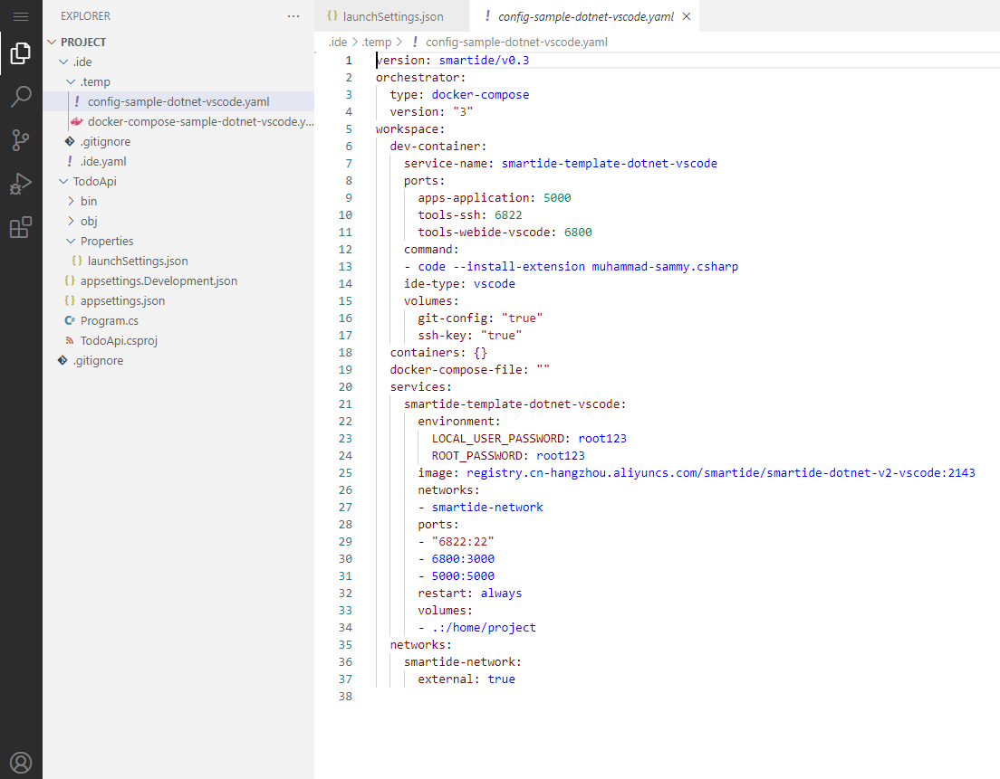
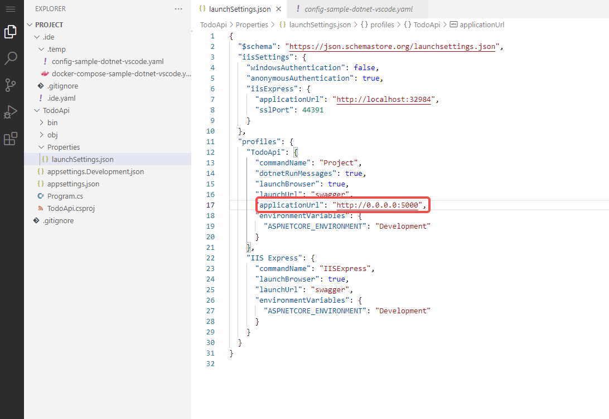
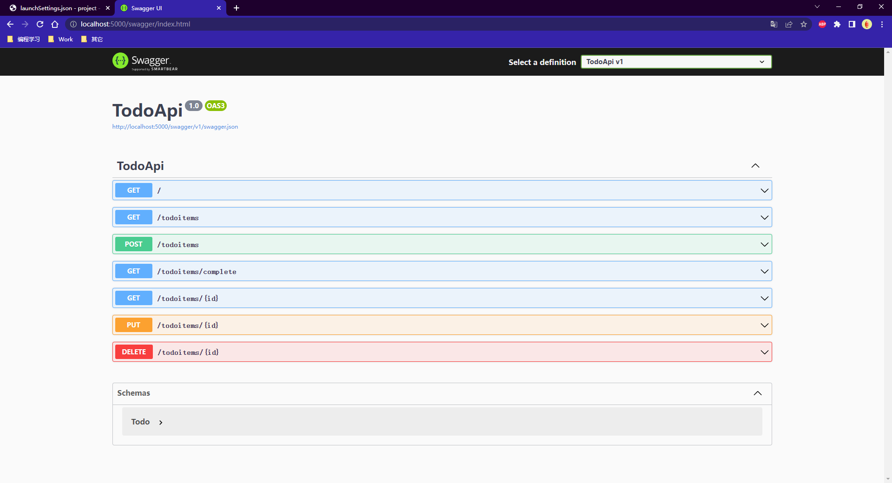

SmartIDE内置了.NET 6开发环境模板，你可以通过一个简单的指令创建带有WebIDE的开发环境，并立即开始编码和调试。


如果你还没有完成SmartIDE安装，请参考 [SmartIDE 安装手册](/zh/docs/install) 安装SmartIDE命令行工具。

> 说明：SmartIDE的命令行工具可以在Windows和MacOS操作系统上运行，对大多数命令来说，操作是完全一致的。本文档中虽然使用的是MacOS上的截图，但是Windows环境的所有日志和工作状态完全一致。对于脚本格式有区别的地方，我们会同时提供2套脚本。


## VSCode

###  1. 创建开发环境

运行以下命令创建.NET 6开发环境：

```shell
# 在 MacOS/Windows 上打开 终端（Terminal）或者 PowerShell 应用
# 执行以下命令
mkdir sample-dotnet-vscode 
cd sample-dotnet-vscode
smartide new dotnet -t vscode
```

运行后的效果如下，通过命令窗口中的日志详细了解SmartIDE的 启动过程，会自动打开浏览器窗口并导航到VSCode界面，输入 dotnet --version 你可看到dotnet sdk 6.0已经安装完毕。


###  2. 创建ASP.NET Core minimal  web API 项目

基于刚才搭建的环境中已经集成了dotnet sdk，现在只需要打开VS Code编辑器的命令行终端执行如下指令来初始化一个基于 ASP.NET Core 的minimal  web API项目


```shell
# 初始化dotnet minimal web api 项目
dotnet new webapi -minimal -o TodoApi
```


执行成功后Web Api项目已经初始化成功了如下图：


打开VS Code 命令终端执行如下命令安装EntityFrameworkCore工具包：


```shell
# 访问TodoApi项目文件夹
cd TodoApi
# 安装Nuget包（Microsoft.EntityFrameworkCore.InMemory）
dotnet add package Microsoft.EntityFrameworkCore.InMemory
# 安装Nuget包（Microsoft.AspNetCore.Diagnostics.EntityFrameworkCore）
dotnet add package Microsoft.AspNetCore.Diagnostics.EntityFrameworkCore
```


修改Program.cs文件，代码如下：


```C#
using Microsoft.EntityFrameworkCore;

var builder = WebApplication.CreateBuilder(args);

// Add services to the container.
// Learn more about configuring Swagger/OpenAPI at https://aka.ms/aspnetcore/swashbuckle
builder.Services.AddEndpointsApiExplorer();
builder.Services.AddSwaggerGen();
builder.Services.AddDbContext<TodoDb>(opt => opt.UseInMemoryDatabase("TodoList"));
builder.Services.AddDatabaseDeveloperPageExceptionFilter();

var app = builder.Build();

// Configure the HTTP request pipeline.
app.UseSwagger();
app.UseSwaggerUI();

app.MapGet("/", () => "Hello World!");

app.MapGet("/todoitems", async (TodoDb db) =>
    await db.Todos.ToListAsync());

app.MapGet("/todoitems/complete", async (TodoDb db) =>
    await db.Todos.Where(t => t.IsComplete).ToListAsync());

app.MapGet("/todoitems/{id}", async (int id, TodoDb db) =>
    await db.Todos.FindAsync(id)
        is Todo todo
            ? Results.Ok(todo)
            : Results.NotFound());

app.MapPost("/todoitems", async (Todo todo, TodoDb db) =>
{
    db.Todos.Add(todo);
    await db.SaveChangesAsync();

    return Results.Created($"/todoitems/{todo.Id}", todo);
});

app.MapPut("/todoitems/{id}", async (int id, Todo inputTodo, TodoDb db) =>
{
    var todo = await db.Todos.FindAsync(id);

    if (todo is null) return Results.NotFound();

    todo.Name = inputTodo.Name;
    todo.IsComplete = inputTodo.IsComplete;

    await db.SaveChangesAsync();

    return Results.NoContent();
});

app.MapDelete("/todoitems/{id}", async (int id, TodoDb db) =>
{
    if (await db.Todos.FindAsync(id) is Todo todo)
    {
        db.Todos.Remove(todo);
        await db.SaveChangesAsync();
        return Results.Ok(todo);
    }

    return Results.NotFound();
});

app.Run();

class Todo
{
    public int Id { get; set; }
    public string? Name { get; set; }
    public bool IsComplete { get; set; }
}

class TodoDb : DbContext
{
    public TodoDb(DbContextOptions<TodoDb> options)
        : base(options) { }

    public DbSet<Todo> Todos => Set<Todo>();
}
```


继续执行如下命令确保当前项目初始化正确：


```shell
# 编译dotnet TodoApi项目
dotnet build
# 启动dotnet TodoApi项目
dotnet run
```


如果输出结果如下图，说明当前初始化项目能编译通过并且可以正常启动


通过启动项目输出的日志了解当前初始化项目默认设置的端口为7163与5105 与SmartIDE初始化的环境开放的端口不一致，访问.ide文件夹下的.ide.yaml





你会看到端口是可以通过当前文件进行配置的，这里默认开放的端口如下：
- 6822映射容器的22端口用于ssh连接访问
- 6800映射容器的3000端口用于web ide窗口访问
- 5000映射容器的5000端口用于对你当前开发项目的访问


 访问TodoApi项目下的Properties文件夹下的launchSettings.json文件


修改 applicationUrl 属性如下：


```json
"applicationUrl": "http://0.0.0.0:5000",
```





由于localhost指的是127.0.0.1是一个回环地址，这个地址发出去的信息只能被自己接受，宿主机是无法通过这个IP地址访问进来的，0.0.0.0表示的是所有的IPV4地址，如果当前的宿主机如果有多个IP地址并且0.0.0.0开放5000端口，那么该端口均可以被这些IP访问到，再次启动项目，访问地址http://localhost:5000/swagger如下图：




###  3. 开发调试

完成以上配置之后，你的代码已经完全准备好，可以开始进行编码调试了。

首先，我们建立一个controller包，路径为cn.smartide.smartidedemo.controller，并且新建一个类：SmartIDEController.java，代码如下

```java
/*SmartIDEController.java*/

package cn.smartide.smartidedemo.controller;

import org.springframework.boot.autoconfigure.EnableAutoConfiguration;
import org.springframework.web.bind.annotation.RequestMapping;
import org.springframework.web.bind.annotation.RequestParam;
import org.springframework.web.bind.annotation.RestController;

@RestController
@EnableAutoConfiguration
public class SmartIDEController {
    @RequestMapping("/home")
    String home(@RequestParam String language) {
        String hello = "Hello, SmartIDE Users!";
        return hello + " The dev language is:" + language + ".";
    }
}
```
新建完成后，在启动类 **SmartideDemoApplication.java** 点击Debug，通过Debug模式启动项目。启动调试后，请注意 smartide 客户端的日志输出，SmartIDE 会在后台持续监控容器内的进程情况，并将所有端口转发到 localhost 上


在**SmartIDEController.java**文件的 **第13行** 代码处 **单击设置断点** 


在浏览器中输入地址： **http://localhost:8080/home?language=Java** 触发我们之前所设置的断点，


现在，进入到调试状态，注意上图中的几个关键点

1. 通过打开 http://localhost:8080/home?language=Java 这个地址触发我们预设的断点
2. 将鼠标移动到特定的变量上以后，IDE 会自动加载当前变量的结构体以及赋值状态（实时），方便开发者观察运行时状态
3. Variables (变量) 窗口实时显示当前运行时内的变量状态
4. Call Stack (调用堆栈) 窗口实时显示当前运行时堆栈状态

点击单步运行，并跳出断点，页面将返回输出结果，如下图所示：


**至此，我们已经使用 SmartIDE 完成了一个 Spring Web 应用程序的创建，配置和编码调试过程。**

###  5. 提交并分享

SmartIDE 环境中已经内置了 Git 的支持，你可以点击 **菜单栏左侧 ｜ 源代码管理 ｜ 点击 Initialize Repository 按钮** 将当前工作区初始化成一个 Git代码库。


在 **提交注释** 中填写 **使用SmartIDE创建**，然后点击 **提交按钮** 


点击 **Remote | Add Remote** 按钮，添加一个远端 Git库 地址。SmartIDE 支持任何Git服务，包括：GitHub, Gitlab, Azure DevOps, Gitee 等等。


> 这时，我们可以将创建的这份代码推送到了类似Gitee的代码仓库上，代码库地址类似如下
> https://gitee.com/smartide/sample-java-vscode

至此，我们已经使用 SmartIDE 完成了一个 Spring Boot 应用从环境搭建，创建基础代码结构，配置调试环境，完成编码开发到提交代码的全过程。

**现在可以将你的代码库发送给其他的小伙伴，让他通过以下指令一键启动你的应用。**

```shell
smartide start https://gitee.com/smartide/sample-java-vscode
```

是不是很爽！

## JetBrains IntelliJ IDEA

###  1. 新建开发环境

运行以下命令创建Spring Web项目开发环境：

```
mkdir sample-java-idea
cd sample-java-idea
smartide new java -t idea
```

运行后的效果如下，你可以通过命令窗口中的日志详细了解 SmartIDE 的启动过程，当 SmartIDE 启动完毕之后，会自动打开浏览器窗口并导航到 WebIDE 界面。


###  2. 创建并配置项目

SmartIDE启动的JetBrains IDEA环境为 **社区版**，在新建Spring Web项目时，建议安装Spring初始化插件，这样新建项目会更加方便。
这里我们安装第三方插件：**Spring Initializr and Assistant**。

点击插件，在搜索框输入：**Spring Initializr and Assistant**，并安装插件。


接受第三方插件安装:


安装完毕后，新建项目：


使用 Spring Initializr向导 新建项目：


输入项目信息：


选择项目依赖项目信息，这里我们选择了两个依赖，分别是：
- 1）Developer Tools -> Lombok
- 2）Web -> Spring Web


修改项目名称，以及默认 **保存路径**：


至此，Spring Web项目已创建完成。

下面，打开**File**—**Project Structure**—**Modules** ( Win快捷键：`Ctrl+Alt+Shift+S`，Mac快捷键 `Command+;` ) ，设置Maven项目的目录结构：
- 1）`src/main/java`：Sources文件夹
- 2）`src/main/resources`：Resources文件夹
- 3）`src/test/java`：Tests文件夹


接着，我们设置依赖拉取地址为国内阿里源，在pom.xml中**第5行**，添加：

```xml
<repositories>
    <repository>
        <id>alimaven</id>
        <name>aliyun maven</name>
        <url>http://maven.aliyun.com/nexus/content/groups/public/</url>
        <releases>
            <enabled>true</enabled>
        </releases>
        <snapshots>
            <enabled>false</enabled>
        </snapshots>
    </repository>
</repositories>
<pluginRepositories>
    <pluginRepository>
        <id>alimaven</id>
        <name>aliyun maven</name>
        <url>http://maven.aliyun.com/nexus/content/groups/public/</url>
        <releases>
            <enabled>true</enabled>
        </releases>
        <snapshots>
            <enabled>false</enabled>
        </snapshots>
    </pluginRepository>
</pluginRepositories>
```
设置完毕后，在pom.xml文件中，指定**spring-boot-maven-plugin**插件版本：


点击**Reload All Maven Projects**，重新加载Maven项目。Maven项目加载完毕后，点击mvn install，触发依赖下载与安装：


至此，我们设置完毕项目所有的Maven依赖，这时可以启动Spring Web项目了。

###  3. 开发调试

完成以上配置之后，基础代码已经完全准备好，就可以开始进行编码调试了。

首先，我们建立一个controller包，路径为cn.smartide.demo.controller，并且新建一个类：SmartIDEController.java，代码如下:
```java
/*SmartIDEController.java*/

package cn.smartide.demo.controller;

import org.springframework.boot.autoconfigure.EnableAutoConfiguration;
import org.springframework.web.bind.annotation.RequestMapping;
import org.springframework.web.bind.annotation.RequestParam;
import org.springframework.web.bind.annotation.RestController;

@RestController
@EnableAutoConfiguration
public class SmartIDEController {
    @RequestMapping("/home")
    String home(@RequestParam String language) {
        String hello = "Hello, SmartIDE Users!";
        return hello + " The dev language is:" + language + ".";
    }
}
```

新建完成后，在启动类 **SmartideDemoApplication.java** 上右键点击Debug，通过Debug模式启动项目。启动调试后，请注意 smartide 客户端的日志输出，SmartIDE 会在后台持续监控容器内的进程情况，并将所有端口转发到 localhost 上


在**SmartIDEController.java**文件的 **第15行** 代码处 **单击设置断点** 


在浏览器中输入地址：**http://localhost:8080/home?language=Java** 触发我们之前所设置的断点，


现在，进入到调试状态，注意上图中的几个关键点

1. 通过打开 http://localhost:8080/home?language=Java 这个地址触发我们预设的断点
2. 将鼠标移动到特定的变量上以后，IDE 会自动加载当前变量的结构体以及赋值状态（实时），方便开发者观察运行时状态
3. Variables (变量) 窗口实时显示当前运行时内的变量状态
4. Debugger (调试) 窗口实时显示当前运行时堆栈状态

点击单步运行，并跳出断点，页面将返回输出结果，如下图所示：


**至此，我们已经使用 SmartIDE 完成了一个 Spring Web 应用程序的创建，配置和编码调试过程。**


###  4. 提交并分享

环境中已内置了git命令，这里我们通过命令行的方式，将代码提交到远端 Git库。
SmartIDE 支持任何Git服务，包括：GitHub, Gitlab, Azure DevOps, Gitee 等等。


下面我们执行git提交命令：
```shell
# 初始化git仓库
git init
# 添加项目文件
git add .
# 提交
git commit -m "使用SmartIDE创建smartide-java-demo"
# 添加远端地址
git remote add origin https://gitee.com/smartide/sample-java-idea
# 推送到远端
git push -u origin "master"
```

> 这时，我们可以将创建的这份代码推送到了类似Gitee的代码仓库上，代码库地址类似如下 https://gitee.com/smartide/sample-java-idea

至此，我们已经使用 SmartIDE 完成了一个Spring Web 应用从环境搭建，创建基础代码结构，完成编码开发调试到提交代码的全过程。

**现在可以将你的代码库发送给其他的小伙伴，让他通过以下指令一键启动你的应用。**

```shell
smartide start https://gitee.com/smartide/sample-java-idea
```

是不是很爽！

###  5. 快速创建Spring Boot项目
SmartIDE模板中提供了创建Spring Boot的示例模板，可以更快速地创建一个Spring Web项目。
命令如下：
```shell
smartide new java -t springboot-idea
```
详情请参考：https://gitee.com/smartide/smartide-springboot-template

基于Spring Boot并包含前端、数据库等的Java项目，可参考示例应用-**[若依项目](../../examples/ruoyi/)**。

## 远程开发

上面我们已经使用SmartIDE的本地工作区模式完成了一个应用的创建和开发过程，这个过程和你所熟悉的开发模式有2个区别，1）我们使用了WebIDE；2）开发环境全部通过容器获取并运行。

在这个过程中你的项目代码也已经具备了远程开发的能力，你可以按照以下文档中的说明使用任意一种远程工作区来开发调试你的应用

- [远程主机工作区](/zh/docs/overview/remote-workspace/#远程主机工作区)
- [k8s工作区](/zh/docs/overview/remote-workspace/#k8s工作区)
- [Server工作区](/zh/docs/overview/remote-workspace/#server工作区)

另外，你也可以通过VSCode或者JetBrains内置的远程开发模式进行Hybird模式的远程开发，具体请参考

- [IDE远程开发操作手册](/zh/docs/manual/ide-remote/)

---
**感谢您对SmartIDE的支持：Be a Smart Developer，开发从未如此简单。**
