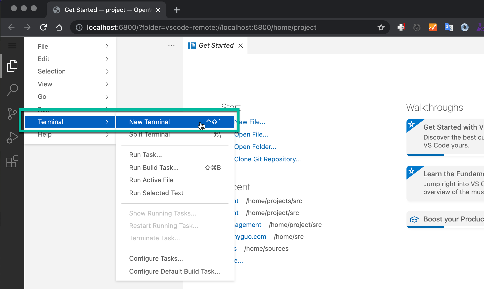
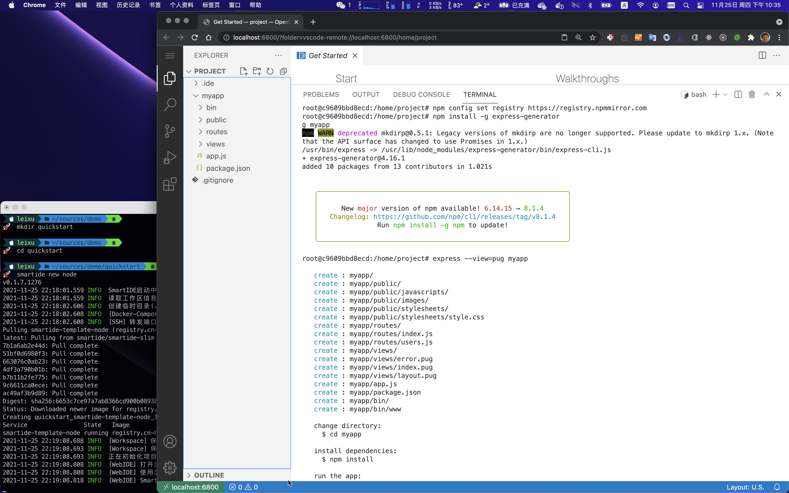
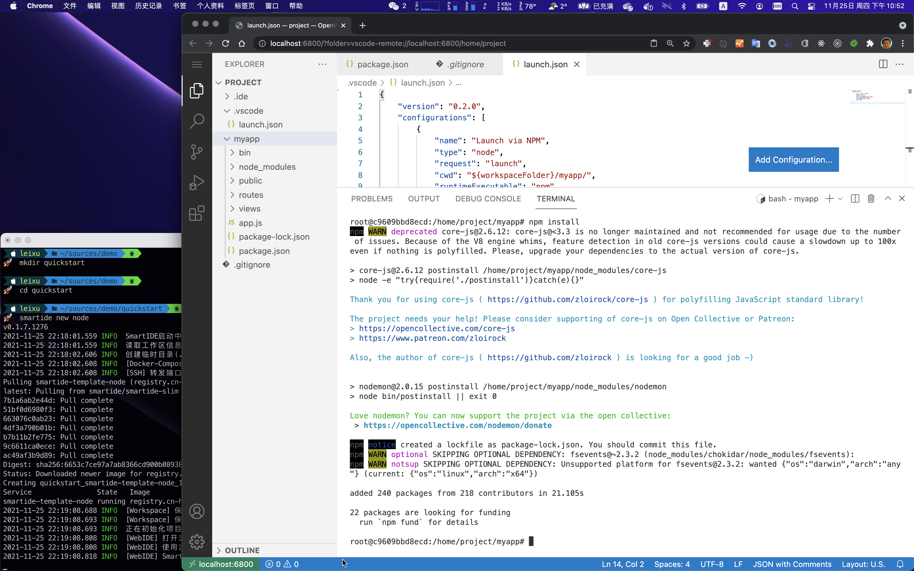
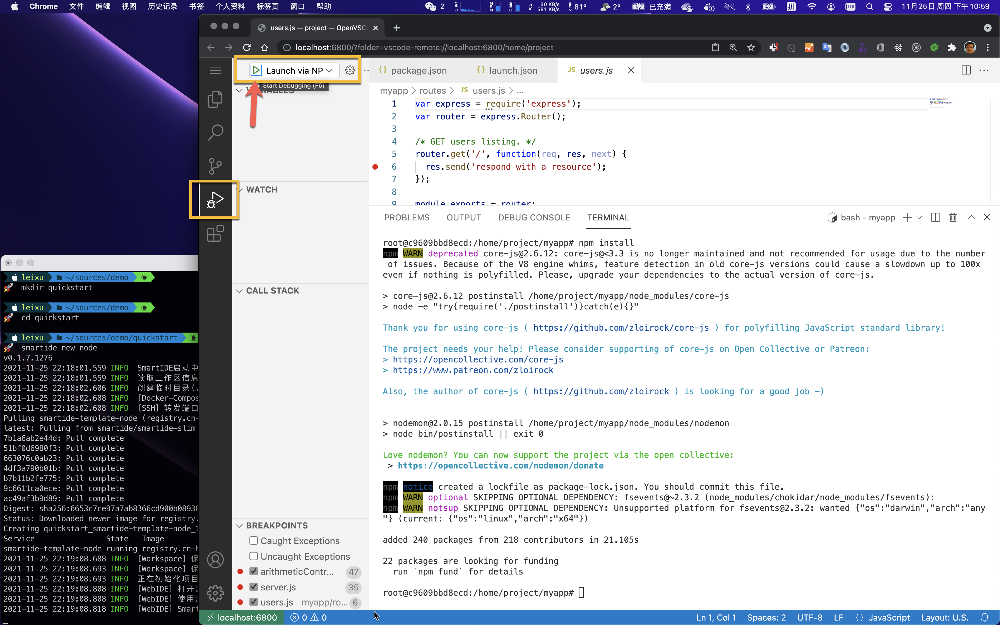
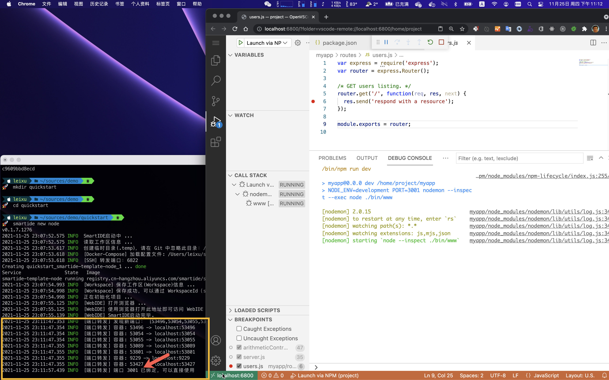
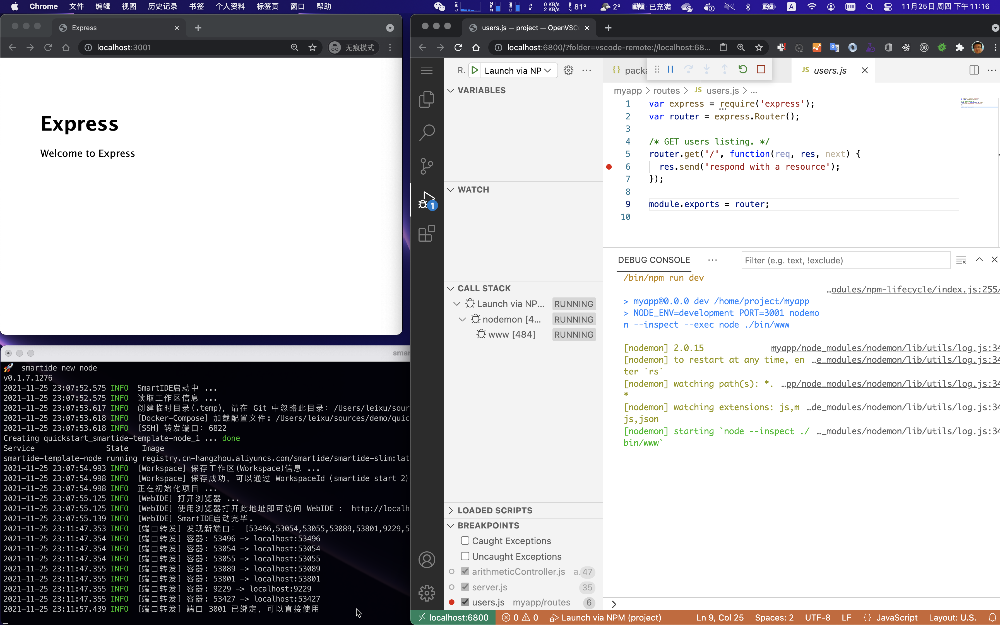
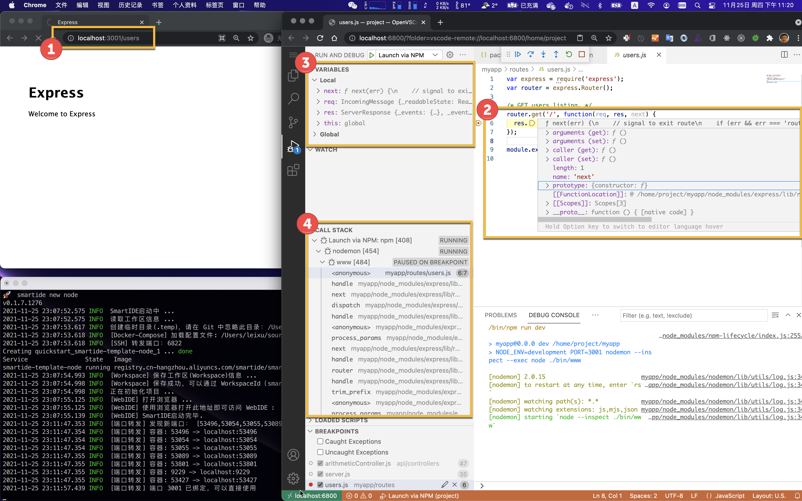
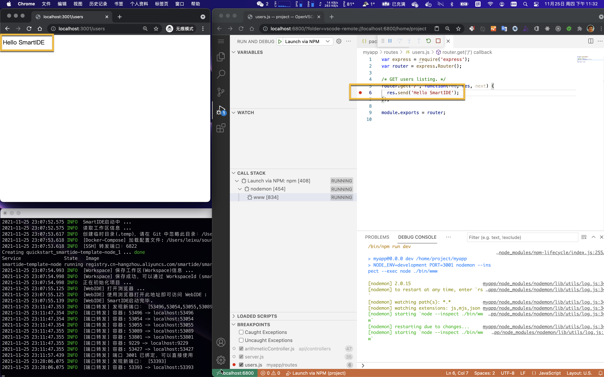
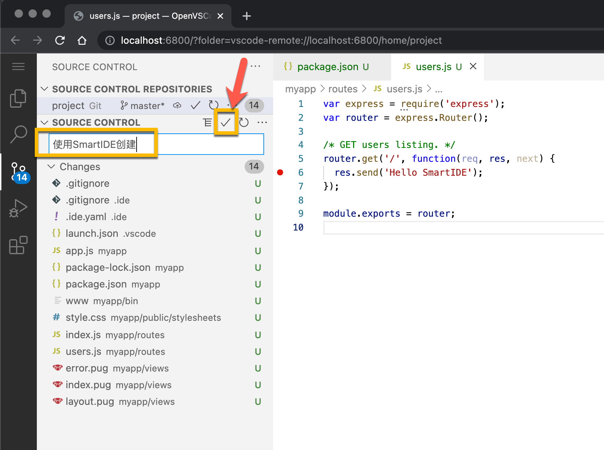
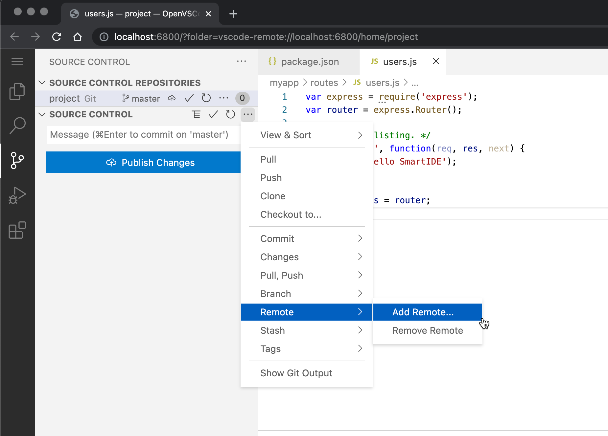

SmartIDE内置了node.js开发环境模板，你可以通过一个简单的指令创建带有WebIDE的开发环境，并立即开始编码和调试。

如果你还没有完成SmartIDE安装，请参考 [SmartIDE 安装手册](/zh/docs/install) 安装SmartIDE命令行工具。

> 说明：SmartIDE的命令行工具可以在Windows和MacOS操作系统上运行，对大多数命令来说，操作是完全一致的。本文档中虽然使用的是MacOS上的截图，但是Windows环境的所有日志和工作状态完全一致。对于脚本格式有区别的地方，我们会同时提供2套脚本。


## 使用Node VSCode 开发镜像

###  1. 新建node vscode 本地WebIDE模式容器开发环境

运行以下命令创建node开发环境：


{}
```shell
# 在 MacOS 上打开 终端（Terminal）应用，复制粘贴以下脚本
# 可以复制所有脚本一键执行，如果需要分布执行，请删除结尾处的反斜杠
mkdir node-quickstart 
cd node-quickstart 
smartide new node -t vscode 或者 se new node -t vscode
```
{}
{}
```powershell
# 在 Windows 上打开 PowerShell 应用，复制粘贴以下脚本
# 可以复制所有脚本一键执行，如果需要分布执行，请删除结尾处的单引号
mkdir node-quickstart 
cd node-quickstart 
smartide new node -t vscode 或者 se new node -t vscode
```
{}


运行后的效果如下，你可以通过命令窗口中的日志详细了解 SmartIDE 的启动过程，当 SmartIDE 启动完毕之后，会自动打开浏览器窗口并导航 WebIDE 界面。


**启动WebIDE内置的Terminal**

后续的操作我们会通过 WebIDE 内置的 Terminal 来完成，默认情况下 Web Terminal 应该已经自动打开，如果没有的话，可以通过 WebIDE 内置菜单的 **Terminal | New Terminal** 打开新的 Web Terminal 窗口。



Web Terminal 开启后如下图所示：


###  2. 创建项目结构

> 注意：如果没有特别提示，后续的命令都是在这个 Web Terminal 中运行的。

运行以下命令将 node 包管理器 npm 的源地址设置到国内淘宝镜像，这样可以明显改善后续的操作流畅性。

```shell
npm config set registry https://registry.npmmirror.com
```

运行以下命令安装 express 脚手架工具并创建 node express 项目基础代码结构

```shell
npm install -g express-generator
express --view=pug myapp
```

执行完毕后的效果如下，左侧文件管理器里面已经出现了 newapp 文件夹，并在其中创建了 node express 应用的基础代码结构，右侧 Terminal 窗口中列出了创建过程的日志信息。



###  3. 配置项目

使用以下内容对 **/newapp/package.json** 文件进行全文替换，这里我们设置了几个关键配置

- 设置了 npm start 启动脚本使用 production 环境变量和 3001 端口
- 设置了 npm run dev 启动脚本使用 development 环境变量、 3001 端口，并且使用 nodemon 工具提供更好的调试体验

```json
{
  "name": "myapp",
  "version": "0.0.0",
  "private": true,
  "scripts": {
    "start": "NODE_ENV=production PORT=3001 node ./bin/www",
    "dev": "NODE_ENV=development PORT=3001 nodemon --inspect --exec node ./bin/www"
  },
  "dependencies": {
    "cookie-parser": "~1.4.4",
    "debug": "~2.6.9",
    "express": "~4.16.1",
    "http-errors": "~1.6.3",
    "morgan": "~1.9.1",
    "pug": "2.0.0-beta11",
    "nodemon": "~2.0.15"
  }
}
```

创建 **/.vscode/launch.json** 文件，并写入如下内容：

> 注意：.vscode 目录一定要放置在工作区根目录中

- 此文件为 vscode 的调试器启动配置文件，因此我们的代码结构兼容使用vscode桌面版直接进行开发调试
- 配置了 debugger 的启动命令为 package.json 所定义的 npm run dev 脚本

```json
{
    "version": "0.2.0",
    "configurations": [
        {
            "name": "Launch via NPM",
            "type": "node",
            "request": "launch",
            "cwd": "${workspaceFolder}/myapp/",
            "runtimeExecutable": "npm",
            "runtimeArgs": ["run","dev"],
            "port": 9229 
        }
    ]
}
```

现在我们可以运行脚本完成 npm 依赖包的安装

```shell
cd myapp
npm install
```

运行后的效果如下：



###  4. 启动调试

完成以上配置之后，你的代码已经完全准备好，可以开始进行编码调试了。

在 **/myapp/routes/users.js** 文件的 **第6行** 代码处 **单击设置断点** 


点击 **左侧菜单栏 ｜ 调试按钮 ｜ 点击 启动按钮** 启动交互式调试



启动调试后，请注意 smartide 的日志输出，SmartIDE 会在后台持续监控容器内的进程情况，并将所有端口转发到 localhost 上



现在你可以开启一个新的浏览器，按照日志中所提示的 3001 端口，打开 http://localhost:3001，就可以访问这个应用了。进入交互式调试状态的 SmartIDE 开发环境如下图：



现在，让我们打开 http://localhost:3001/users 以便触发我们之前所设置的断点，注意下图中的几个关键点

1. 通过打开 http://localhost:3001/users 这个地址触发我们预设的断点
2. 将鼠标移动到特定的变量上以后，IDE 会自动加载当前变量的结构体以及赋值状态（实时），方便开发者观察运行时状态
3. Variables (变量) 窗口实时显示当前运行时内的变量状态
4. Call Stack (调用堆栈) 窗口实时显示当前运行时堆栈状态



保持以上调试状态，直接对代码进行修改，打开 **/myapp/routes/users.js** 文件并将 **第6行** 按下图进行修改，修改完成后保存文件，并按下 **调试控制拦** 上的 **继续按钮**


此时，你可以看到左侧应用运行窗口中已经按照你的修改自动加载了修改后的代码。

> 此功能借助 nodemon 对代码文件进行性监控，并在检测到改动的时候自动进行重新编译；以上我们所配置的 package.json 和 launch.json 的配置是实现这一场景的关键性配置。如果你发现你的环境无法完成以上操作，请仔细检查这两个文件的内容。



**至此，我们已经使用 SmartIDE 完成了一个 Node Express 应用程序的创建，配置和编码调试过程。**

###  5. 提交代码

SmartIDE 环境中已经内置了 Git 的支持，你可以点击 **菜单栏左侧 ｜ 源代码管理 ｜ 点击 Initialize Repository 按钮** 将当前工作区初始化成一个 Git代码库。


在 **提交注释** 中填写 **使用SmartIDE创建**，然后点击 **提交按钮** 



点击 **Remote | Add Remote** 按钮，添加一个远端 Git库 地址。SmartIDE 支持任何Git服务，包括：GitHub, Gitlab, Azure DevOps, Gitee 等等。



> 为了方便大家查看本演示所创建的代码，我已经将这份代码推送到了Gitee上，代码库地址如下
> https://gitee.com/smartide/smartide-quickstart

至此，我们已经使用 SmartIDE 完成了一个 Node Express 应用从环境搭建，创建基础代码结构，配置调试环境，完成编码开发到提交代码的全过程。

###  6. 将创建好的基础项目分享给团队成员，一键启动

**现在可以将你的代码库发送给其他的小伙伴，让他通过以下指令一键启动你的应用的应用。**

```shell
mkdir smartide-quickstart
cd smartide-quickstart
smartide start https://gitee.com/smartide/smartide-quickstart
```

是不是很爽！


## 使用Node WebStorm 开发镜像

###  1. 新建node WebStorm 本地WebIDE模式容器开发环境

运行以下命令创建node开发环境：


{}
```shell
# 在 MacOS 上打开 终端（Terminal）应用，复制粘贴以下脚本
# 可以复制所有脚本一键执行，如果需要分布执行，请删除结尾处的反斜杠
mkdir node-quickstart 
cd node-quickstart 
smartide new node -t webstorm 或者 se new node -t webstorm
```
{}
{}
```powershell
# 在 Windows 上打开 PowerShell 应用，复制粘贴以下脚本
# 可以复制所有脚本一键执行，如果需要分布执行，请删除结尾处的单引号
mkdir node-quickstart 
cd node-quickstart 
smartide new node -t webstorm 或者 se new node -t webstorm
```
{}


运行后的效果如下，你可以通过命令窗口中的日志详细了解 SmartIDE 的启动过程，当 SmartIDE 启动完毕之后，会自动打开浏览器窗口并导航 WebIDE 界面。

###  2. 创建项目结构及后续操作

使用 WebStorm 进行NodejS开发，与上一节的 VSCode类似，JetBrains提供的种语言的IDE已经集成了基本的IDE插件，运行起来后开箱即用，调试、编写代码此处不再赘述。

## 使用本地IDE客户端进行远程开发

上一节步采用的是WebIDE，且WebIDE已经集成至开发容器中。如果想要用本机已装好的VSCode，或者是JetBrans的WebStorm、IDEA进行远程开发，可以参考 [这篇文章](../../ide/remote/)

gateway 模式? TODO


##  使用 SmartIDE 远程模式启动开发环境

SmartIDE支持三种运行方式：   
 
- 本地模式：**即本篇前两节采用的模式**

- 远程模式：*开发容器及WebIDE运行在远程服务器上*

- k8s模式： 开发容器及WebIDE运行在k8s集群中


远程模式启动也非常简单，可以使用下面的命令一键启动上文中提交的项目：
```bash
smartide start --host <HostID>  https://gitee.com/smartide/smartide-quickstart
```

**三种模式的详细介绍可以参考 [这篇文档](../../overview/)**
