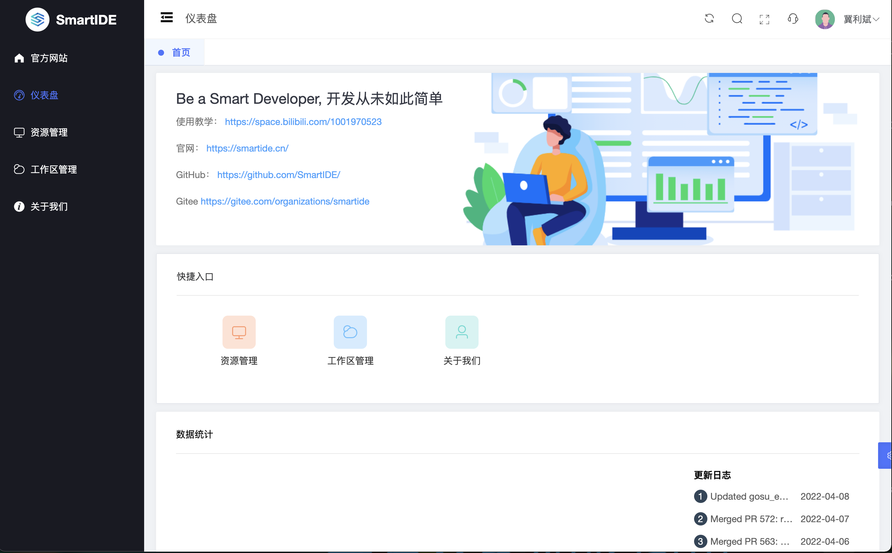
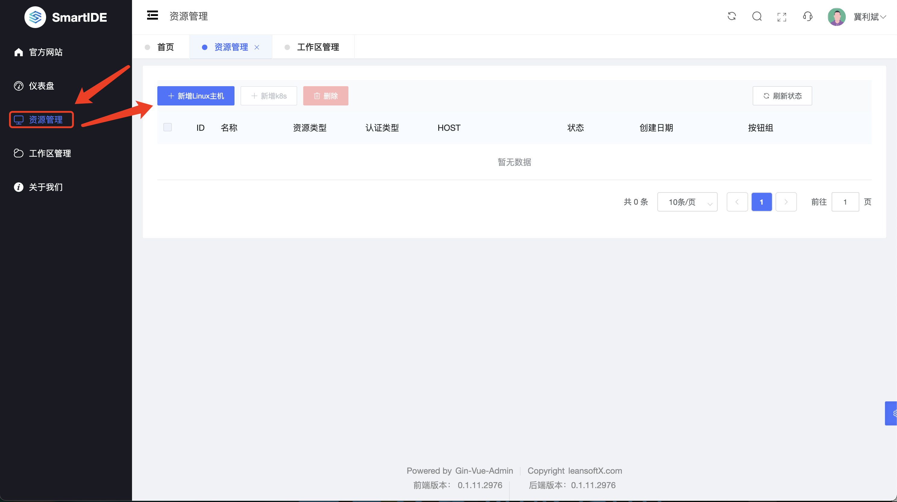
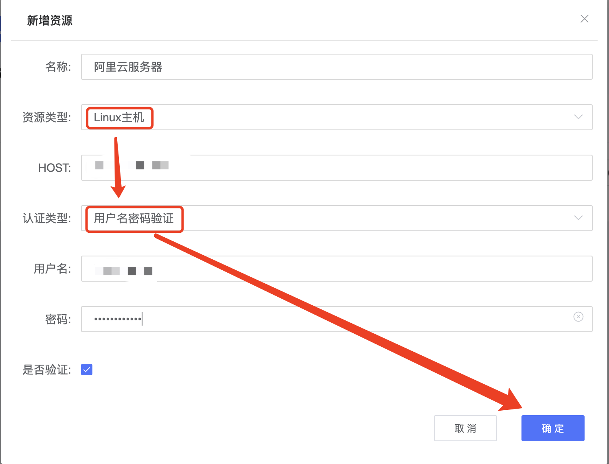
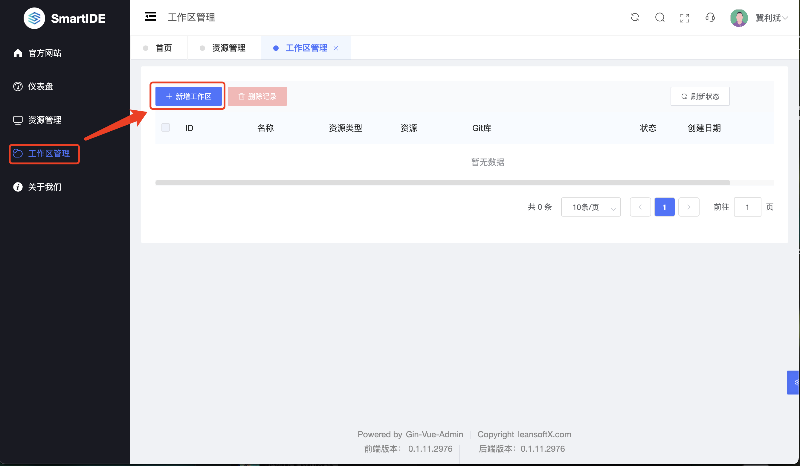
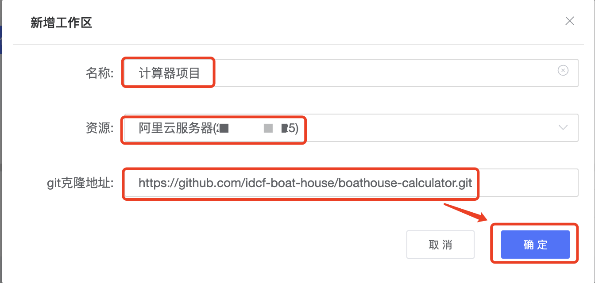
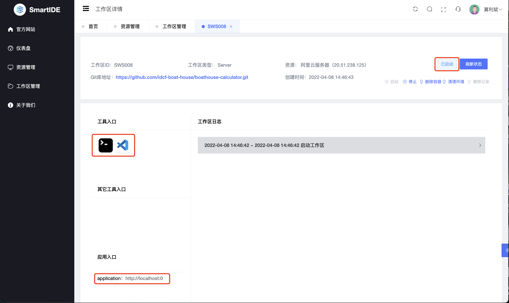
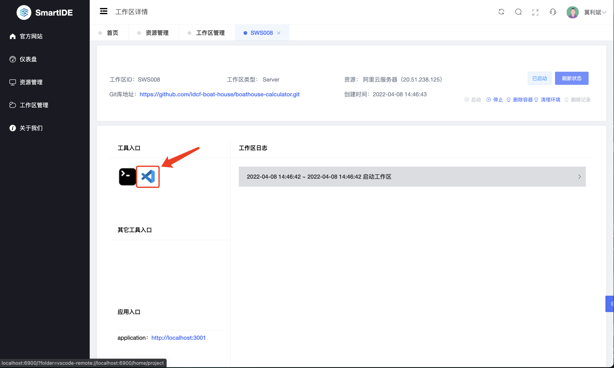

## 概述
SmartIDE Server 为开发团队提供对开发环境的统一在线管理和访问能力，企业管理者可以通过SmartIDE Server为开发团队提供统一的一致的开发环境，大幅降低开发者花费在搭建环境上的时间消耗，让开发者可以将更多的精力投入到业务需求开发和技术方案改进上。更为重要的是，SmartIDE Server提供了完全受控的开发测试环境，管理者可以通过工作区策略对开发环境进行管理，比如：
- 端到端的代码安全：通过策略配置实现开发者只能通过浏览器修改和发布代码，完全避免开发者将代码下载到个人开发机上；
- 质量左移：通过指定制定策略在开发者提交代码之前就进行质量门禁的验证，从而彻底杜绝有问题的代码进入代码仓库；
- 优化DevOps流水线：通过提供与生产环境一致的开发测试环境部署方式，大幅降低DevOps流水线的复杂度，并通过将更多的串行的流水线环节集成到开发编码过程中，大幅缩短流水线运行时间并提高部署成功率。

SmartIDE Server 使用容器和云原生技术，可以部署在任何标准的虚拟化或者k8s平台上，企业云管理员可以自行完成SmartIDE Server的私有部署，并将企业内部开发团队的开发测试环境纳入企业云的管理之中。开发测试环境一旦纳入云平台的管理可以有效降低企业内部开发测试环境的管理复杂度，提高资源利用率；容器化开发测试环境可以根据开发者的需要动态的创建或者销毁环境，为开发测试环境提供弹性伸缩能力。与当前企业中大量使用的基于VDI的开发测试环境管理模式相比，基于容器的开发测试环境将大幅提高资源利用率，同时大幅降低成本。

对于开发者而言，使用SmartIDE Server可以完全消除开发者搭建环境的技能要求，避免因为环境不一致或者工具/SDK版本，安装配置问题所造成的时间浪费，让开发者将更多的精力投入到更有价值的应用开发中去。对于团队而言，当一个团队成员开始使用SmartIDE以后，其他开发者就可以完全重用这个环境，而不必重新配置；如果一名成员变更了环境配置，其他的成员也可以通过一个简单的git pull就可以获取到这个变更后的开发环境。

## 操作手册
使用SmartIDE你可以在5分钟内完成任何开发语言，任何代码的开发环境搭建。以下，我们以IDCF Boathouse 计算器应用为例，说明如何使用SmartIDE Server进行这个应用的开发和调试过程。

###  1. 登录
首先，让我们登录到SmartIDE Server，我们提供了托管的SmartIDE Server环境，当前这个环境仍然处于内测阶段，账号需要我们的管理员为您创建，暂时不开放自助注册功能。如果您需要访问我们托管的SmartIDE Server，可以扫描以下二维码加入我们的社区早鸟计划。

a. 请访问SmartIDE Server版网站：[http://dev.smartide.cn/](http://dev.smartide.cn/)，登录Server版：

b. 输入已分配的账号、密码，以及验证码，点击【登录】：

c. 登录后，进入SmartIDE首页：

###  2. 创建资源

资源是SmartIDE Server用于管理主机和k8s的方式，用户可以将自己的主机或者k8s集群加入到SmartIDE Server中进行统一管理。一旦资源纳入SmartIDE Server的管理，就可以通过以下的工作区管理功能在对应的资源上运行容器化开发环境，并通过WebIDE的方式进行访问。

> <i>**说明**：当前仍未开放k8s资源的管理特性，请持续关注我们的开发进展，我们会在第一时间通知您最新的特性列表。</i>

a. 点击左侧【资源管理】菜单，进入资源管理列表后，点击【新增Linux主机】按钮，添加主机资源：

> <i>**说明**：添加主机前，需要主机已完成 [SmartIDE初始化配置](https://smartide.cn/zh/docs/install/docker-install-linux/) 。</i>

在这里，需要填写以下信息：
- 名称：自定义资源的名称，后续在新建工作区时，可以选择工作区所部署的资源。
- 资源类型：选择Linux主机。
- HOST：已准备好的Linux主机IP地址。
- 用户名/密码：已配置好SmartIDE初始化环境的主机用户名密码。不推荐使用root账号。

填写完毕后，点击【确定】按钮。

b. 创建成功后，列表中，可以看到刚刚添加的记录。

###  3. 创建在线工作区

工作区是SmartIDE中用于管理开发环境的单元，每个代码版本对应一个工作区。当你完成了资源创建后，就可以通过工作区管理，在这些资源上创建工作区了。

> <i>**注意**：我们使用的Boathouse计算器中已经适配了SmartIDE工作区，如果你需要在SmartIDE中运行其他代码的开发环境，请参考 [项目适配](../adaption/) 文档。</i>

a. 资源创建完毕后，点击【工作区管理】，进入工作区列表，此时点击【新增工作区】按钮。

这里输入工作区名称，选择刚刚建立的主机资源，并且输入git克隆地址，点击【确定】按钮。

b. 新增工作区后，在工作区列表中查看到工作区记录及其运行状态。点击工作区【详情】按钮，进入工作区。

c. 工作区详情中，我们可以看到工作区已经处于部署之中，并且会刷新状态。启动成功后，工作区变为【已启动】状态，并且因为我们在项目中通过SmartIDE配置文件.ide.yaml进行了IDE及端口声明，所以可以明确地看到工作区要对应的IDE图标以及应用访问地址，如下图所示：

到这里，工作区就已经准备就绪了。

###  4. 通过CLI客户端，连接工作区，完成应用的开发与调试
当前，SmartIDE仅支持通过cli建立安全隧道（SSH Tunnel）的方式的方式访问工作区。未来我们会提供完全在线的方式，这样就通过一个简单的URL来访问你的工作区。

a. 本地安装客户端，具体操作步骤及安装脚本见：[客户端安装](../../install)。

b. 安装完毕后，运行 se connect 命令连接server工作区。

c. 返回SmartIDE Server工作区页面，点击IDE图标，如下图：

d. 返回SmartIDE Server工作区页面，点击IDE图标，打开WebIDE界面：

e. 到这里，就可以像本地IDE一样，进行日常代码的开发以及调试了。

> <i>**说明**：有关如何在WebIDE中开发和调试Node.js应用的方法，请参考 [cli快速启动](../../quickstart/cli) 和 [node快速启动](../../quickstart/node) 文档。</i>

## 私有化部署
SmartIDE Server提供私有化部署，你可以在任何公有云/私有云，甚至虚拟机上完成私有部署。有关私有部署的详细操作手册，请持续关注此文档。

---
**感谢您对SmartIDE的支持：Be a Smart Developer，开发从未如此简单。**